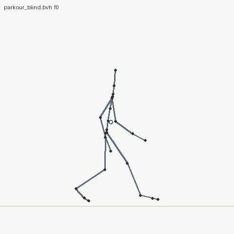
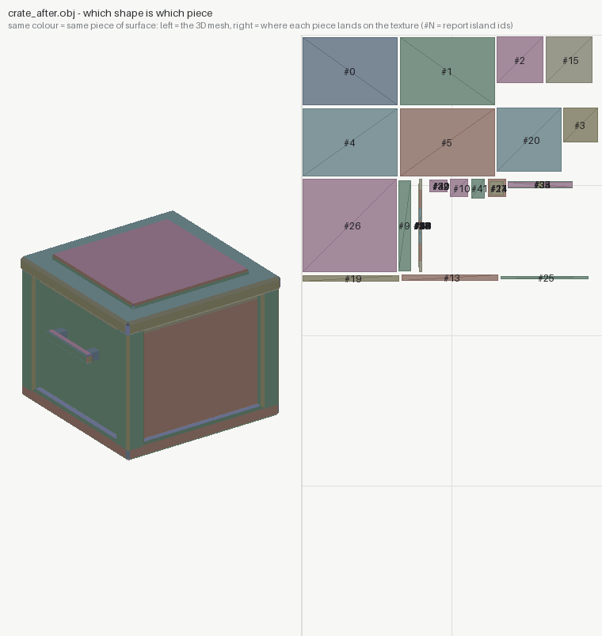

# AISight


**Sight for AI agents.** An agent cannot look at a screen — and almost
everything creative software asks a human to *look at* is actually a
measurable property of the data. AISight is a family of five
independent tools, one per domain, that replace looking with measuring:
deterministic builds, exact reports with `where` and `try:` on every
finding, and renders only as evidence for what the numbers found.

| tool | domain | replaces | docs |
|---|---|---|---|
| **solidsight** | 3D design / CAD / 3D printing | eyes on a viewport | [README](solidsight/README.md) |
| **animationsight** | animation clips, mocap (.bvh) | watching the take | [README](animationsight/README.md) |
| **texturesight** | UVs + texture maps | squinting at a checker | [README](texturesight/README.md) |
| **shadersight** | materials/BRDFs + node graphs | rendering a sphere | [README](shadersight/README.md) |
| **pcbsight** | PCB layouts (.kicad_pcb) | eyeballing copper | [README](pcbsight/README.md) |

## Install

Each tool is its own pip package: install **one**, **some**, or **all**.
They share a philosophy, not a dependency — none requires another.

**One tool** (its folder name is its subdirectory):

```bash
pip install "git+https://github.com/VortexJer/AISight#subdirectory=solidsight"
pip install "git+https://github.com/VortexJer/AISight#subdirectory=animationsight"
pip install "git+https://github.com/VortexJer/AISight#subdirectory=texturesight"
pip install "git+https://github.com/VortexJer/AISight#subdirectory=shadersight"
pip install "git+https://github.com/VortexJer/AISight#subdirectory=pcbsight"
```

**All five** in one line:

```bash
for t in solidsight animationsight texturesight shadersight pcbsight; do pip install "git+https://github.com/VortexJer/AISight#subdirectory=$t"; done
```

or from a checkout:

```bash
git clone https://github.com/VortexJer/AISight
pip install ./AISight/solidsight ./AISight/animationsight ./AISight/texturesight ./AISight/shadersight ./AISight/pcbsight
```

Requirements: Python >= 3.10, pip, git. solidsight carries the heavy
dependencies (manifold3d, trimesh, scipy, matplotlib — all wheels); the
other four need only numpy and pillow.

## What installing gives an AI agent

Every tool ships its **Claude Code skill inside the pip package**. The
first time its CLI runs on a machine that has Claude Code (`~/.claude`
exists), the skill installs itself into `~/.claude/skills/<tool>/` and
keeps itself updated on version changes — from then on, any new agent
session routes matching requests to the tool ("design a bracket" ->
solidsight, "review this .bvh" -> animationsight, "check my board" ->
pcbsight). No Claude Code? The CLIs work standalone for humans and
scripts; nothing else is touched.

`<tool> uninstall` removes the skill AND the pip package. No telemetry,
no services, no accounts.

## The showcase: one robot through all five tools

[`showcase/`](showcase/) takes **Vigía**, a desk robot, from nothing to
a printable enclosure, a routed controller board, a simulation-ready
URDF, a textured game asset, validated materials and a reviewed servo
gesture — entirely by an AI agent, entirely through measurements. The
enclosure does not copy the board's dimensions: it **imports pcbsight
and reads them from the .kicad_pcb**, so the standoffs sit at the
board's own mounting pads.

Every stage caught real defects the agent could not see — 31 board
findings (both USB nets open with swapped ends), five enclosure
iterations (servos placed where the servo *headers* are, a neck ring
floating over the open shell), a flipped UV island, a boosted copper
emitting 53% more light than it receives, a stepped servo profile demanding 3600 deg/s of a 600 deg/s servo —
and every fix ends in a diff that proves it.

<p align="center">
  
  
</p>
<p align="center">
  
  
  
</p>
<p align="center"><em>the assembly with its electronics as X-ray ghosts · the board pcbsight took from 31 findings to 0 · the boosted-vs-physical copper · the robot performing its servo gesture</em></p>

Full narrative and the defect scoreboard: [showcase/README.md](showcase/README.md).

## Blind vs measured: the controlled studies

Four hero examples run the same experiment: a cold-context agent with
**no tools at all** (numpy/PIL, no viewer, one shot) attempts a hard
commission; the same commission then goes through the tool's loop. The
blind sides are genuinely competent — the defects they ship are the
ones nobody can see without measuring:

| study | blind | after |
|---|---|---|
| [parkour vault](animationsight/examples/03-parkour) (animationsight) | a 0.47x g stride, root on rails in the turn, a knee pop at landing | **OK — 0 findings**, every flight at 1 g |
| [hero crate](texturesight/examples/03-crate-hero) (texturesight) | 148 flipped UVs (FAIL), 7.35:1 stretch, 54x density spread | 0 flips, 1.005 anisotropy, 3.35x |
| [material set](shadersight/examples/04-materials) (shadersight) | 8/8 conserve — the one FAIL was the tool's own estimator noise | tool fixed + graph 436 → 204 ALU/px |
| [rover board](pcbsight/examples/02-rover) (pcbsight) | 12 open nets, 26 clearance faults | routed: **OK — 0 findings** |

**Left: blind. Right: through the loop.** Same commission, same author
competence — the only variable is being able to measure.

<p align="center">
  
  
</p>
<p align="center"><em>the parkour vault — blind: a 0.47x g stride, a turn step on invisible rails, a knee pop at the landing · after: every flight at 1 g, <b>0 findings</b></em></p>

<p align="center">
  
</p>
<p align="center"><em>how to read a UV picture: the flat shapes ARE the crate's surface peeled onto the texture (same colour = same piece — a box unfolded into its cardboard template)</em></p>

<p align="center">
  
  
</p>
<p align="center"><em>the hero crate's UVs — blind: 148 flipped faces (red), 7.35:1 stretch, 336 stacked islands · after: same geometry and maps, mapper rewritten — 0 flips, welded shells, 92% packing</em></p>

<p align="center">
  
  
</p>
<p align="center"><em>what shadersight is for: the "boosted highlights" copper emits <b>1.7x the light it receives</b> (curve far above the red ceiling) yet its preview sphere looks almost identical to the physical one — the eye can't audit energy. The blind-vs-measured study's twist: the blind author knew its F0s and <b>refused the boost bait</b>; the one FAIL was the tool's own estimator noise on an exact-F0 gold, fixed at 16x sampling.</em></p>

<p align="center">
  
  
</p>
<p align="center"><em>the rover board — blind: 12 open nets, 26 clearance faults circled in red · after: routed, <b>0 findings</b></em></p>

Each README credits what the blind side got right, ties every fix to a
measured finding, and lists the bugs the studies forced back into the
tools themselves.

## The standard every tool holds itself to

- **Known ground truth**: every example is synthetic on purpose, with
  defects injected at exact magnitudes, so the tests assert the *right*
  answer — and that the clean reference stays clean, because false
  positives are how a tool loses the right to be believed.
- **Deterministic**: same input, byte-identical report; fixed seeds
  where sampling is involved, resolution stated in the report.
- **The full loop**: inspect -> fix -> **diff to prove the fix did what
  you meant and nothing else**.
- **Honest scope**: each README lists what is NOT read or checked.

The family overview — and the bugs each tool caught in its own
reference, which is the recurring proof of the whole idea:
[docs/roadmap-sights.md](docs/roadmap-sights.md).

## Repository layout

```
solidsight/      3D design: engine + CLI, skill/ (+ domains/), examples, benchmarks
animationsight/  motion clips as measurement
texturesight/    UVs + texture maps
shadersight/     materials + node graphs
pcbsight/        board layouts
showcase/        Vigia: one robot through all five tools (the flagship demo)
docs/            the blind-vs-loop comparison study, plugins, family roadmap
```

Each tool folder is self-contained: `pyproject.toml`, the package, its
`skill/`, `examples/` with committed real outputs, and `tests/`.

## License

MIT
