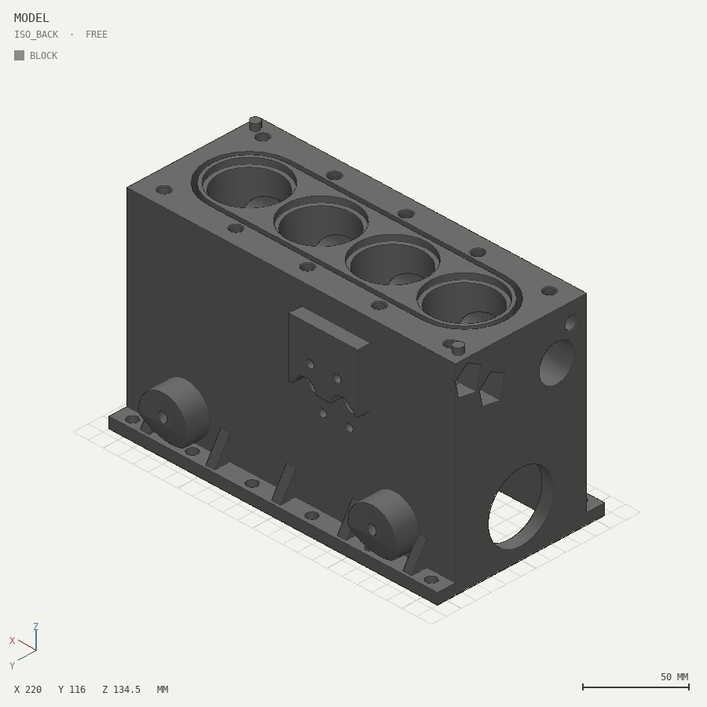
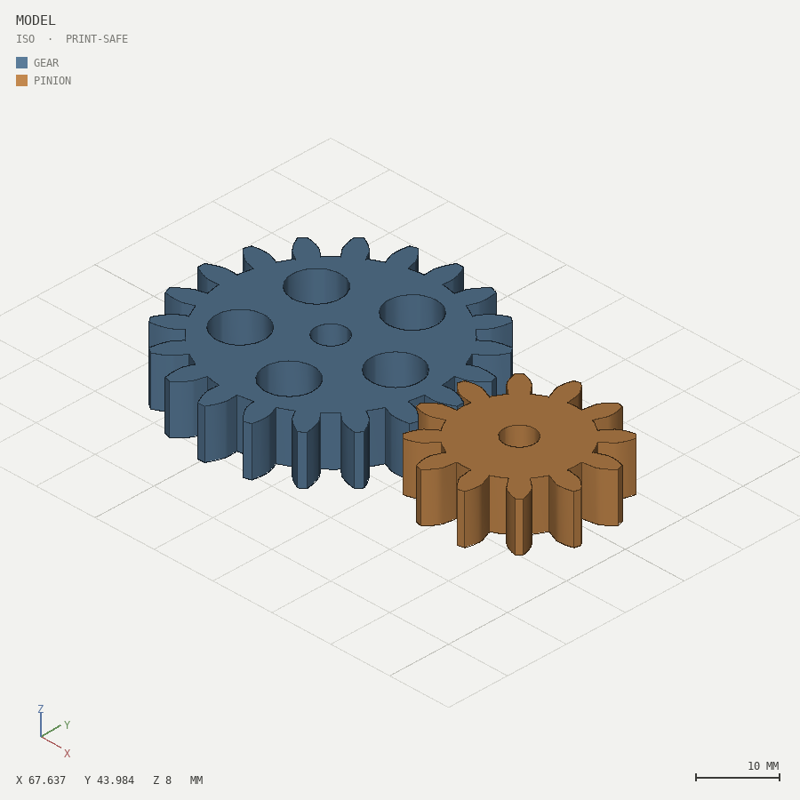
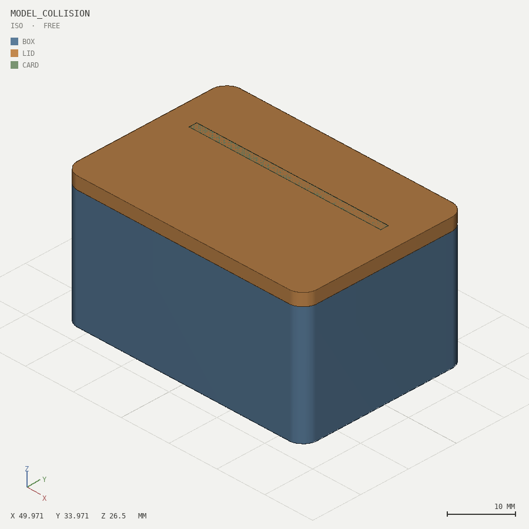
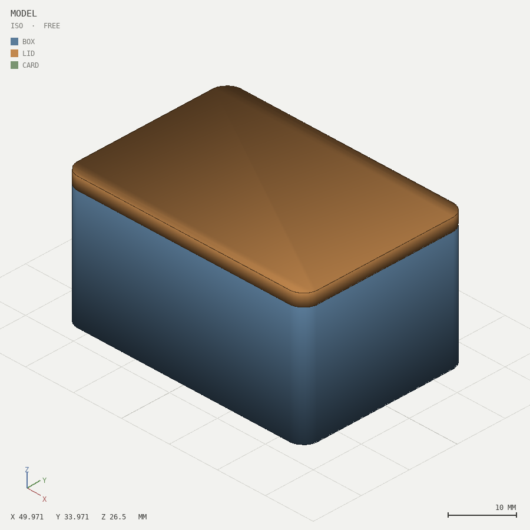

# solidsight


**A 3D design tool built exclusively for AI agents.** Parametric Python in;
deterministic geometry, multi-angle PNG renders, and a machine-readable
validation report out.

An LLM writing CAD code is blind: it can reason about geometry but cannot see
what it made. Human CAD tools assume eyes on a screen and a hand on a mouse.
solidsight closes the loop the way an agent needs it closed — every build
produces images to *look at* and exact numbers to *check*, plus errors written
to be read by a model, not a human at a console.

```
write code  ->  solidsight build  ->  renders + report.json  ->  inspect  ->  adjust  ->  repeat
```

<p align="center">
  
  
</p>

## Quickstart (30 seconds)

```bash
pip install "git+https://github.com/VortexJer/SolidSight#subdirectory=tool"
# or from a checkout:  pip install ./tool

cat > model.py <<'EOF'
from solidsight import *
plate = rect(60, 40).round_corners(4).extrude(5)
hole = cylinder(h=7, d=4.5).translate(0, 0, -1)
plate = plate - parts.grid_pattern(hole, 2, 2, 44, 28).translate(-22, -14, 0)
boss = parts.standoff(h=8, od=8, id_=3.2)
emit(plate + boss, name="plate")
EOF

solidsight build model.py --print-safe --stl
# -> out/renders/01_iso.png ... 04_top.png   (look at these)
# -> out/report.json                          (volume, walls, overhangs, checks)
# -> out/stl/plate.stl
```

The build summary ends with the tool's whole philosophy in one line:
`NEXT: open the renders and LOOK at them, then read report.json checks.`

## What the agent gets on every build

- **Renders** — orthographic PNGs (iso/front/right/top + more, turntable,
  exploded view), one muted color per named part with an on-image legend,
  sharp-edge overlay, 10 mm ground grid, axis triad, exact bbox dimensions
  and a scale bar burned into every frame. Deterministic software rasterizer:
  no GPU, no OpenGL, byte-identical output for identical input.
- **report.json** — per part: exact volume, surface area, bbox, center of
  mass, shell count, genus, watertightness, minimum wall thickness (with the
  coordinates of the thinnest point), overhang analysis, sealed-cavity
  detection. Per pair of parts: exact collision bbox + volume + a concrete
  move suggestion, or the minimum clearance between surfaces. Every finding
  carries `where` and a `try:` suggestion.
- **Cross-sections** — `--slice z=5` renders the filled section; internal
  walls and fits are invisible from outside.
- **Exact spatial queries** (no vision needed):
  `solidsight query model.py point|ray|section|voxels ...` — point
  classification, ray crossings with per-wall thicknesses, ASCII material
  grids, voxel grids with flood-fill cavity detection.
- **Errors written for LLMs** — what failed, where (file:line, names,
  coordinates, bounding boxes), and what to try next. Never "invalid
  geometry".

## Before / after: one turn of the loop

Real, committed output from [`05-assembly`](skill/examples/05-assembly): a
divider tray was designed 8 mm too tall and pokes through the closed lid.

<p align="center">
  
  
</p>
<p align="center"><em>before: the tray (green) pierces the lid &nbsp;·&nbsp; after: seated under the lip with declared clearance</em></p>

**Before** — the agent doesn't have to *see* it; the report says exactly
what, where and how much:

```
[WARN] parts "lid" and "card" occupy the same space (160 mm3 of overlap)
       where: overlap bbox x -20..20, y 4.2..5.8, z 24..26.5
       try:   move 'card' 1.7 mm along y, or rework the joint; ...
```

**After** — one edit later, the declared spec holds:

```
pair 'box' <-> 'lid':  touching, clearance 0.0 mm   [spec MET: touching]
pair 'card' <-> 'lid': clear, clearance 0.2 mm      [spec MET: clearance >= 0.15 mm]
```

**And the change is auditable** — `solidsight diff before/ after/`:

```
diff: model_collision.py [warnings] -> model.py [ok]
  part 'card': volume 1536.0 -> 1024.0 (-512.0 mm3); size [40.0, 1.6, 24.0] -> [40.0, 1.6, 16.0]
  part 'box': unchanged        part 'lid': unchanged
  GONE [WARN] parts "lid" and "card" occupy the same space (160 mm3 of overlap)
  render 01_iso.png: 0.3% of pixels differ
```

The edit did what it meant — and provably nothing else.

## Two validation modes

- `--print-safe` — for parts that will be manufactured: enforces watertight,
  single shell per part, minimum wall thickness, no sealed cavities; warns on
  overhangs and floating parts. Non-zero exit code on failure, so CI works.
- `--free` (default) — visual/artistic exploration: same metrics reported,
  nothing enforced.

## The Claude Code skill

[`skill/SKILL.md`](skill/SKILL.md) teaches an agent the full workflow — bill
of parts before code, catalog before derivation, build-and-look after every
change, exact queries when eyes are not enough, the assembly
collision/clearance loop, detail mode for faithful technical models, and a
definition-of-done checklist.

**It installs itself.** The skill ships inside the pip package: the first
`solidsight` command on a machine with Claude Code drops it into
`~/.claude/skills/solidsight` and keeps it updated. From then on, any 3D
design request in Claude Code routes through it. Manual control:

```bash
solidsight install-skill        # (re)install explicitly
solidsight uninstall            # remove the skill AND the package
```

## Parametric parts catalog

`solidsight catalog` lists battle-tested components so agents compose instead
of re-deriving: involute spur gears, ISO threads/bolts/nuts, print-in-place
hinges, cantilever snap clips + slots, boxes with fitted lids, uniform-wall
containers, standoffs, hex vent cutters + honeycomb panels, linear/grid/
circular patterns, 3D tube sweeps (`tube_path`), 2D ribbon curves
(`stroke`), and real text (emboss/engrave) from the bundled font.

The whole stack was hardened by **blind dogfooding**: five design commissions
executed using only the skill and the CLI (no knowledge of the internals),
with every point of friction fixed at the root — 16 findings, from a
silently-broken shading fallback to false positives in the wall-thickness
metric. Each real bug is pinned by a regression test in `tool/tests/`
(see `CHANGELOG.md`).

## Examples (all outputs generated by the tool, committed as proof)

| example | shows |
|---|---|
| [`01-mounting-bracket`](skill/examples/01-mounting-bracket) | primitives, patterns, print-safe |
| [`02-snap-box`](skill/examples/02-snap-box) | booleans, snap-fit clip/slot pairing |
| [`03-gear-train`](skill/examples/03-gear-train) | catalog gears; pair clearance proves the mesh (0.19 mm backlash) |
| [`04-vase`](skill/examples/04-vase) | organic twisted form in `--free` mode |
| [`05-assembly`](skill/examples/05-assembly) | multi-part assembly; intentional collision caught with exact bbox/volume, then fixed with measured clearances |
| [`06-hidden-cavity`](skill/examples/06-hidden-cavity) | a sealed cavity invisible in renders, caught by the report and provable via `query ray`/`voxels` |
| [`07-engine-block`](skill/examples/07-engine-block) | **detail mode**: a faithful inline-4 block (bores, liner steps, head-bolt matrix, water jacket, cam tunnel, oil galleries, pan rail, gussets, filter pad, inclined mounts) built region-by-region from a feature specification |

## Stack and why

| layer | choice | why |
|---|---|---|
| geometry kernel | [manifold3d](https://github.com/elalish/manifold) | guaranteed-manifold CSG, exact booleans, deterministic, fast, pip-installable everywhere. Not reinvented here — solidsight's value is the feedback loop on top. |
| mesh analysis | [trimesh](https://trimsh.org) | mass properties, adjacency, watertightness |
| rendering | own numpy z-buffer rasterizer + Pillow | zero GPU/driver dependencies, headless on any CI, fully deterministic — the reasons pyrender/OpenGL were rejected |
| text | matplotlib's font machinery | bundled DejaVu font = identical glyph geometry on every machine |

Alternatives considered: **JSCAD** (JS kernel is solid but headless PNG
rendering in Node needs GPU or fragile native deps), **build123d/OCCT** (real
BREP fillets, but a heavyweight install and less cross-platform determinism),
**trimesh-only** (boolean robustness depends on external engines). Manifold
hits the sweet spot: robust, light, deterministic.

## Repository layout

```
tool/     the engine + CLI (pip package "solidsight")
skill/    SKILL.md + references/ + examples/ (models, reports, renders)
README.md LICENSE
```

## Design principles

1. Code is the design language — parametric primitives, booleans,
   transforms. No hand-edited meshes, no GUI.
2. The agent is blind until it renders — so rendering + reporting is the
   core feature, not an add-on.
3. Total determinism — same input, byte-identical output. Agents can trust
   their mental model; CI can diff artifacts.
4. Errors are for LLMs — specific, located, actionable.
5. Don't reinvent the kernel — reinvent the feedback loop.

## License

MIT
