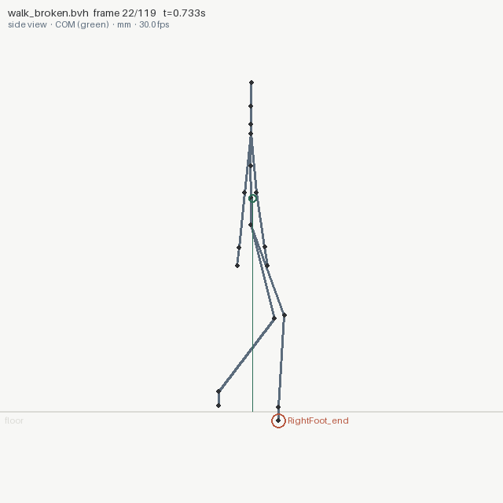
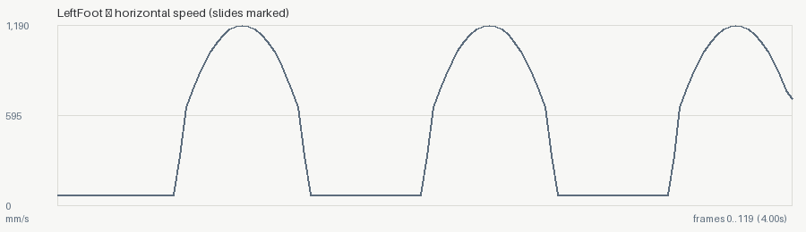

# 01 — A walk cycle, clean and broken

Two clips built by `../make_clips.py`. Same walk; one has three defects
of exactly known magnitude injected into it. Committed outputs are real.

```bash
animationsight inspect walk_clean.bvh  --out out_clean     # -> OK,     exit 0
animationsight inspect walk_broken.bvh --out out_broken    # -> FAILED, exit 2
animationsight diff walk_clean.bvh walk_broken.bvh
```

## The reference is genuinely clean

```
animationsight inspect: OK
  clip: walk_clean.bvh - 120 frames @ 30.0 fps (4.0s), 22 joints, cm, up=y
  COM height: 910.08..934.69 mm (mean 922.87)
  contacts: 10 plant/lift event(s) on LeftFoot, RightFoot ...
  balance: COM up to 173.8 mm from the support base; airborne 4% of frames
  smoothness: roughest joint 'LeftShin' (jerk RMS 63645.3 mm/s3), 0 pop(s)
  loop: CLEAN - full (last frame is one step before the first);
        seam gap 40.62 mm vs 37.44 mm in a normal frame
```

Read that COM height first: ~920 mm is where a walking human's centre
of mass belongs. If it said 92 mm or 9200, the `--unit` would be wrong
and every other number with it.

## The broken clip: every injected defect, found

| injected by `make_clips.py` | what the report says |
|---|---|
| `DIP = 4.0` cm on the right foot, frames 22-26 | `[FAIL] 'RightFoot_end' goes 40.0 mm through the floor` — worst at frame 22, 5 frames affected |
| `+26°` on the left arm, frame 47 only | `[WARN] 9 single-frame acceleration spike(s); worst on 'LeftForearm'` — frame 47 (t=1.5667s), robust z 102.5 |
| `speed_scale = 1.15` (root 15 % faster than the stride) | `[WARN] 'LeftFoot_end' slides while planted: 130.5 mm over 58 frame(s)` |

The pop is reported on `LeftForearm`, not `LeftUpperArm` where it was
injected — correct: the forearm is the arm's child and swings on a
longer lever, so it carries the larger acceleration.

<p align="center">
  
  
</p>
<p align="center"><em>left: frame 22, the offending joint circled below the floor line &nbsp;·&nbsp; right: foot speed over time, slides marked</em></p>

## Why the example is synthetic

Because ground truth is the point. A real mocap take has defects nobody
has enumerated, so it can show that the tool says *something* — never
that it says the *right* thing. Here the answer key is in the generator,
and `tests/` asserts both directions: every injected defect is found,
and the clean reference stays clean.

## What the first version of this example got wrong

The walk was originally written as sinusoids on the joint angles. It
looks like a walk in a viewport. It is not one: the feet never stop
moving, so the whole clip is a moonwalk. animationsight said so on the
first run — minimum foot speed 81 mm/s, never zero, in a clip where a
planted foot must be exactly stationary.

The fix was to build it the way animators do: author the foot's WORLD
trajectory (stance = a fixed point, swing = an arc), then solve the leg
by IK. `test_clean_clip_plants_its_feet` now pins it.

That is the tool's own thesis, applied to itself: the defect was
invisible to inspection and obvious to measurement.
