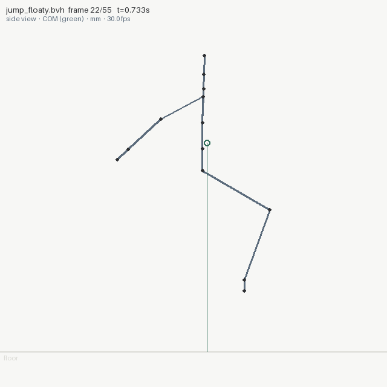
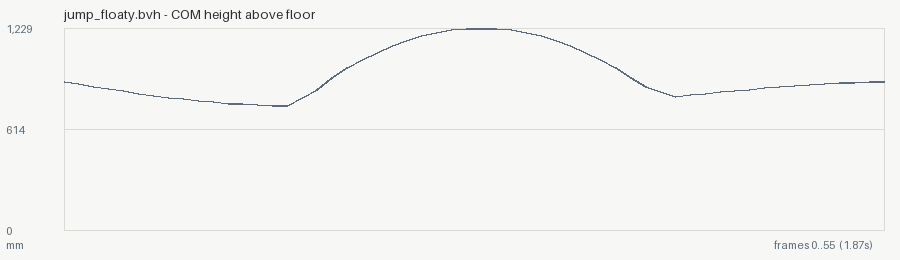

# 02 — The floaty jump (before / after)

The defect nobody can see and everybody can feel. `make_jump.py` writes
the same standing jump twice: once with an arbitrary "looks nice"
airtime, once with the airtime physics demands for that apex.

```bash
animationsight inspect jump_floaty.bvh --kind oneshot --out out_floaty
animationsight inspect jump_fixed.bvh  --kind oneshot --out out_fixed
animationsight diff jump_floaty.bvh jump_fixed.bvh
```

## Before: the flight disobeys gravity

```
flight: frames 17..39 (0.7667s, apex +374.2 mm) -> 0.552x gravity
[WARN] flight at frames [17, 39] falls at 0.55x gravity: it will read as floaty
       where: apex +374.2 mm over 0.7667s; at 1 g that apex takes 0.55s of airtime
       try:   physics fixes it two ways: shorten the airtime to match the apex,
              or raise the apex to match the airtime (T = 2*sqrt(2h/g)); or
              accept the stylised float and say so
```

Every still frame of this clip looks fine — the pose is right, the arc
is smooth. The COM is simply falling at half the acceleration the world
uses, and the only way to know is to fit the parabola. (This clip is a
faithful reproduction of the jump the tool's own author wrote while
dogfooding, floaty without noticing.)

## After: same apex, honest airtime

```
flight: frames 17..33 (0.5667s, apex +373.3 mm) -> 1.005x gravity
```

No floaty-flight finding. The fix came straight from the `try:` line —
`T = 2*sqrt(2h/g)` — not from re-watching anything.

## The diff is the proof

```
diff: jump_floaty.bvh [warnings] -> jump_fixed.bvh [warnings]
  timing: 56 frames @ 30.0003 fps -> 51 @ 30.0003
  flight 0: 0.552x gravity (0.7667s) -> 1.005x gravity (0.5667s)
  'RightShin': peak speed 3819.1 -> 4761.8 mm/s (+942.7)
  ... and 11 more joint(s) with peak-speed changes between +444.5 and +841.3 mm/s
  GONE [floaty-flight] flight at frames [17, 39] falls at 0.55x gravity: ...
```

<p align="center">
  
  
</p>
<p align="center"><em>left: mid-flight, legs tucked, COM (green) drawn with its ground projection · right: the COM height track — that parabola is the thing being measured</em></p>

Both clips also report their pose snaps honestly (`--kind oneshot`
silences only the loop check): this is a blocking-pass jump with
instantaneous pose changes, and the report says so — 8-9 "pose snap"
events, each needing inbetweens.
