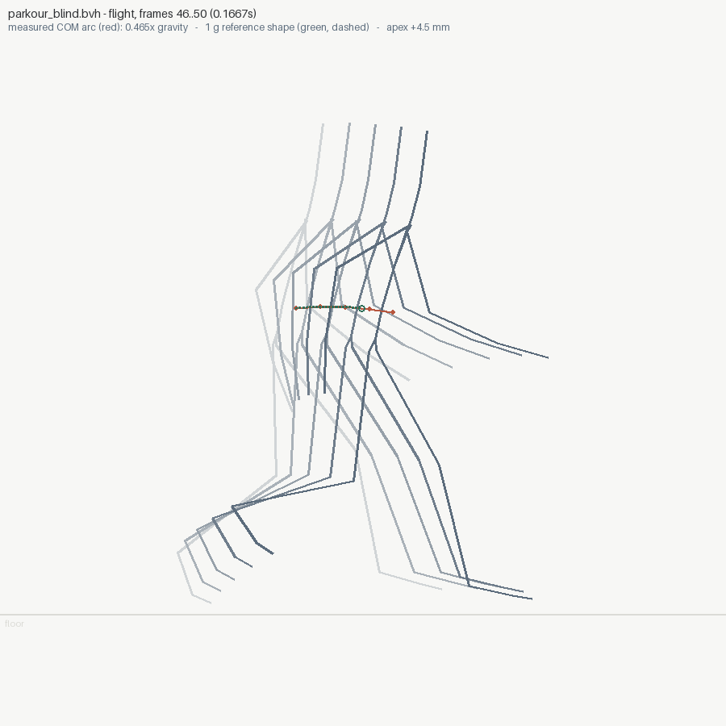
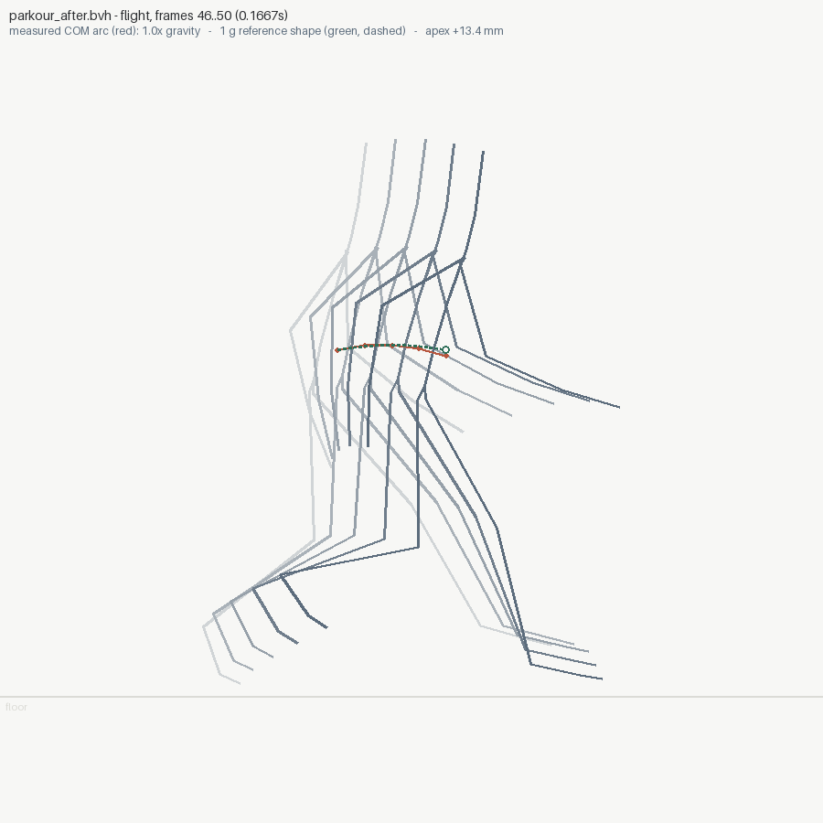

# 03 — parkour vault: blind vs measured

The commission: a 240-frame, 21-joint parkour sequence — approach run,
vault over a 0.9 m obstacle, landing absorption, 90° turn, two strides
to a stop. Two attempts at the SAME brief:

- **`parkour_blind.bvh`** — authored by a cold-context agent with no
  tools at all: no renderer, no metrics, numpy and arithmetic only,
  one shot. (`make_blind.py`)
- **`parkour_after.bvh`** — the same generator taken through the
  animationsight loop: audit, fix what the numbers say, re-audit until
  clean. (`make_after.py`)

| | blind | after |
|---|---|---|
| stride flight (f46–50) | 0.47× gravity | **1.0× gravity** |
| vault flight | 1.03× gravity — already right | 1.001× gravity |
| turn step (f145–149) | "airborne" with a flat root: IK overreach had lifted the planted foot | foot stays planted — the phantom flight is gone |
| discontinuities | knee pop at the landing (116 607 mm/s²) | **0 pops** |
| verdict | `WARNINGS` (3 findings) | **`OK` (0 findings)** |

| blind | after |
|---|---|
|  |  |

## Provenance

The blind side was generated by a fresh-context subagent in an empty
working directory: stdlib + numpy only, explicitly forbidden from
invoking any tool or reading any file, one design pass with
crash-retries only. An earlier pilot baseline was discarded because its
provenance could not be proven. This one's audit is its own proof: an
author secretly using the tool does not ship a 0.47×-g stride, and the
agent even *predicted* its most likely artifact sight unseen — "an
abrupt hip-height transition around the landing frame" — which is
exactly where the audit found the pop.

## What the blind agent got right

Credit where due — more than last time's pilot, and it earned it. The
vault ballistics were solved by hand (v₀ = 2.89 m/s at 9.81 m/s²) and
measure **1.03× g** on the first try. The authored contact schedule
drives analytic 2-bone leg IK, so planted feet are position-locked and
the audit finds **zero foot-sliding across 44 contact events**. Format,
skeleton, winding: correct on the first run. What survived only where
it was explicitly computed is physics — the two flights *nobody planned
as flights* (a run stride, a turn step) got hand-set height keys
instead of gravity, and no eye can tell 0.47 g from 1 g in a 5-frame
hop.

## What the audit measured, and the fix for each

**Floaty stride (frames 46–50, 0.47× g).** The stride flight's hip
height came from hand-set curve keys and was nearly flat (+4.5 mm apex
where 1 g wants a real arc). Fix: the window gets the same treatment
the blind author already gave the vault — a true parabola at g, v₀
solved from the boundary heights. Measures 1.0× g.

stride flight, measured against the dashed 1 g reference:

| blind — the flat red arc is the giveaway | after — arcs coincide |
|---|---|
|  |  |

**Root on rails (frames 145–149).** Reported as "both feet leave the
ground but the COM never falls" — but it was never a jump. During the
turn steps the hips rode at 0.87 m with the planted foot 0.6 m away,
past the 0.815 m leg reach, and the IK clamp silently lifted the
planted foot off the floor. Fix: the turn plants come in closer and
`HIP_Y` dips through the steps (a walk on 0.82 m legs cannot carry the
pelvis at 0.89 m over a stride). The foot stays planted and the
phantom flight disappears from the report.

**Knee pop at the landing (frame 76, 116 607 mm/s²).** The right
foot's vault-swing height profile dropped 0.55 of its arc in 0.30 of
the swing, straight into the plant. Fix: the descent keys ease over a
longer span.

## The iteration the loop is for

Iteration 1 cleared all three findings — and surfaced a **new** pop at
frame 1 (RightToeBase, 13 716 mm/s²) that had been hiding in the blind
clip under the bigger landing pop (the detector's robust threshold
scales with the clip's own noise; smooth the worst spike and the next
one stands out). Iteration 2 guessed at the cause (heel-roll rate) and
the number did not move — guessing was the mistake. A numeric probe of
the arriving ankle then measured the real cause: 27 661 mm/s² of
horizontal swing deceleration dumped into the instant of the plant,
worst at frame 1 only because the clip opens mid-swing. Iteration 3
made swings *arrive* — horizontal travel completes at 88% of the swing
and the last frames drop vertically. `OK`, 0 findings.

## What this example forced INTO the tool

`diff` printed **`0.053x gravity -> Nonex gravity`** when a flight
exists on only one side (the rails step stops being a flight once the
foot stays planted). It now says `no flight`, with a regression test
pinning it.

## The receipts

```text
$ animationsight diff parkour_blind.bvh parkour_after.bvh --kind oneshot
diff: parkour_blind.bvh [warnings] -> parkour_after.bvh [ok]
  flight 0: 0.465x gravity (0.1667s) -> 1.0x gravity (0.1667s)
  flight 1: 1.03x gravity (0.5667s) -> 1.001x gravity (0.5667s)
  flight 2: 0.053x gravity (0.1667s) -> no flight
  GONE [floaty-flight] flight at frames [46, 50] falls at 0.47x gravity
  GONE [motion-pop] 1 discontinuity event(s); worst is a joint pop at frame 76
  GONE [root-on-rails] airborne at frames [145, 149] but the COM never falls
```

## Reproduce

```bash
python make_blind.py && python make_after.py
animationsight inspect parkour_blind.bvh --kind oneshot --out audit_blind --gif
animationsight inspect parkour_after.bvh --kind oneshot --out audit_after --gif
animationsight diff parkour_blind.bvh parkour_after.bvh --kind oneshot
```
