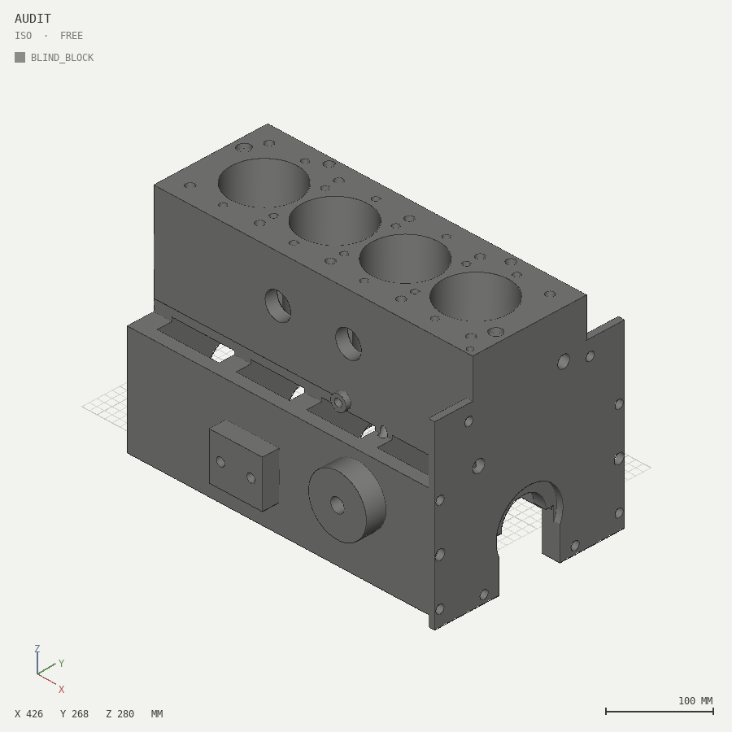
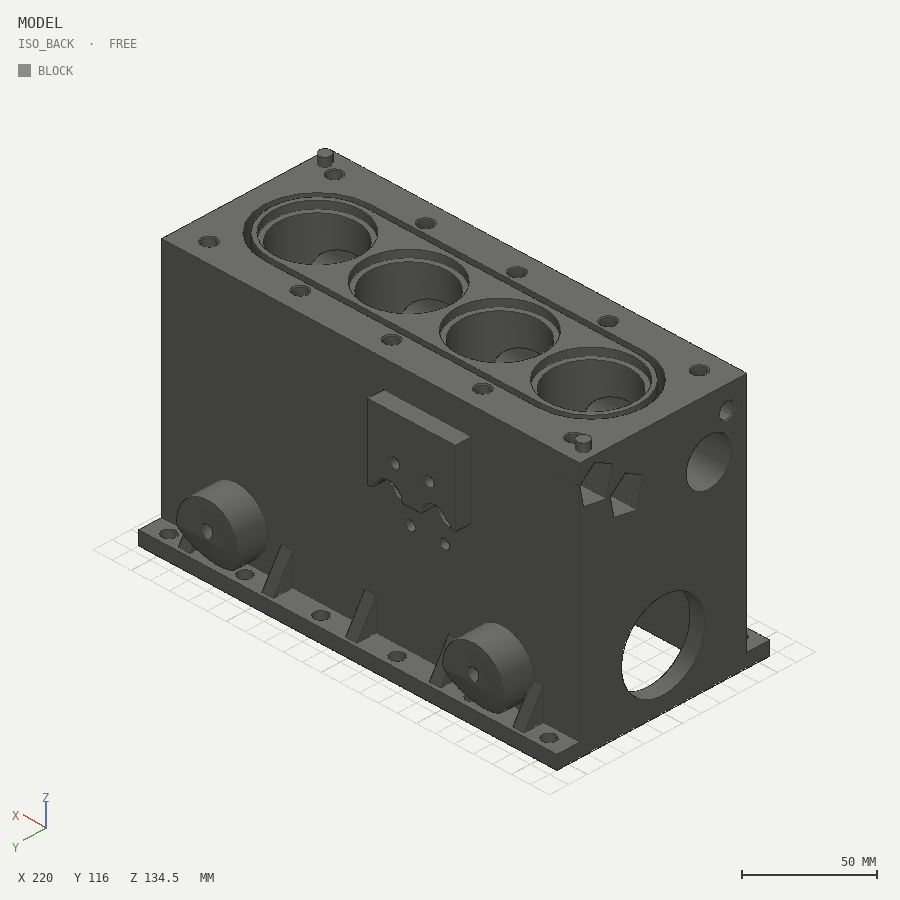

# Same prompt, with and without solidsight

**Prompt (identical for both sides):** *"make a detailed 3D model of an
inline-4 engine block"*.

The only variable is tooling: no feedback loop vs. the solidsight loop.
Nothing on the blind side was touched after its single run, and both
results are audited by the same validator and rendered by the same
renderer.

**Methodology note (transparency).** A first pilot of this comparison
was discarded: its "blind" script was written by an author who had
already built [example 07](../../solidsight/skills/solidsight/examples/07-engine-block)
in the same session, and the result inherited its datums — too good to
be honest. The baseline below was regenerated by a **fresh-context
agent in an empty directory outside the repository**, under hard
constraints: numpy + trimesh only, no CAD tools or skills even if
installed, no reading any file, no visualization of any kind, one
design pass, crash-fix reruns only. Its complete tool trace is four
calls — an import check, one file write, one `python engine_blind.py`,
one directory listing — with **zero crash reruns**. It finished
convinced of success: `watertight: True`, and honest about its limits:
asked to bet where its most likely defect was, it named three
candidates, sight unseen.

| | without (blind one-shot) | with (skill + loop) |
|---|---|---|
| environment | plain Python + trimesh, no renders, no report, no catalog | solidsight + SKILL.md |
| process | one pass, shipped on "exported, watertight=True" | feature spec, region-by-region, build+inspect each region |
| iterations | 1 (by definition — nothing to look at) | 4 (each guided by a finding) |
| artifact | [`blind/engine_blind.py`](blind/engine_blind.py) -> [`engine_blind.stl`](blind/engine_blind.stl) | [`solidsight/skills/solidsight/examples/07-engine-block`](../../solidsight/skills/solidsight/examples/07-engine-block) |

<p align="center">
  
  
</p>
<p align="center"><em>left: blind one-shot &nbsp;·&nbsp; right: same prompt through the loop</em></p>

## What the audit found in the blind output

Credit first: the blind block is genuinely competent. Watertight, a
single shell, closed-deck siamese jacket on a 94 mm pitch, five main
bulkheads with cap-face and half-bores, twin longitudinal oil galleries
with per-bulkhead main feeds, deck transfer holes that really do vent
the main jacket ring, mount bosses whose tapped holes correctly stop
short of the crankcase. The renders look like an engine block.

The audit ([`out/queries.txt`](blind/out/queries.txt), verbatim):

| defect | evidence |
|---|---|
| **eight sealed water-jacket pockets** — the jacket's end lobes reach past the last cylinder wall and nothing connects them: two pockets of **~37 cm³ each**, plus slivers strangled behind the head-bolt boss columns. Coolant can never fill them; a printer cannot drain them | `voxels --res 4`: `SEALED CAVITY: ~36608 mm3 at [-200,-20,110]..[-188,24,214]` (and mirrored at x=192..204); print-safe verdict **FAILED** |
| **main-cap bolt drillings graze the crank tunnel**: the Ø11 holes rise into each bulkhead 26.5 mm off-axis against a Ø60 tunnel, leaving a **1.881 mm** wall on a load-bearing bolt column | report: `min wall 1.881 mm at (-190.0, 25.29, 16.11)` — that point is at exact distance 30.0 from the crank axis: ON the tunnel surface |
| **the pressurized oil gallery runs 3.0 mm from the water jacket** for the full 410 mm length of the block (gallery Ø14 at z=100, jacket floor at z=110) | `ray 47 -52 100 0 0 1`: `material from t=7.0 to t=10.0 (thickness 3.0 mm)` |
| **a 2 mm annular sliver survives below the cap face** at both ends — the nose/seal bosses reach x=±212 but the cap-face cut stopped at ±210 | `point 211 0 -48` -> `INSIDE`; `point 211 0 -25` -> `OUTSIDE` (the leftover ring rim is also why the footprint audits barely-stable) |

The remarkable part: asked to bet blind, the author **predicted the
sliver and the cap-bolt grazing** ("the printed Z-min of −50 already
betrays one") — it could reason about its own likely failures but had
no way to check them. And the two defects it did NOT predict (the
sealed coolant pockets, the gallery-to-jacket wall) are both
**relationships between two features**: each feature correct in
isolation, the interaction wrong, and `watertight=True` silent about
all of it.

## The with-tool side made the SAME kind of mistakes

That is the honest core of this comparison. Building the with-tool
block (example 07), the author's errors were equivalent — the loop just
caught each one:

1. Coolant-port cutters missed the block entirely -> `noop-difference`
   warning with both bounding boxes.
2. Both engine mounts contained **sealed cavities** (the inclined tapped
   holes were buried under the surface) -> `internal-cavity` FAIL.
3. Jacket-to-bore wall of 0.75 mm -> `thin-wall` finding; the jacket was
   rebuilt as a stadium annulus (which is also how real siamese-bore
   blocks work).
4. Head-bolt drill points broke into the cam tunnel — found by the same
   `query ray` used above, fixed to a measured 5.0 mm wall.

Same kinds of blunders — feature-vs-feature interactions. **The tool is
the difference between shipping them and catching them.**

## Reproduce

```bash
cd docs/comparison/blind
solidsight build audit.py --views iso,iso_back --slice x=47 --slice z=150
solidsight build audit.py --print-safe --out out_ps --views iso
solidsight query audit.py voxels --res 4               # the sealed coolant pockets
solidsight query audit.py ray 47 -52 100 0 0 1         # oil gallery -> water jacket: 3.0 mm
solidsight query audit.py point 211 0 -48              # the predicted sliver: INSIDE
```
