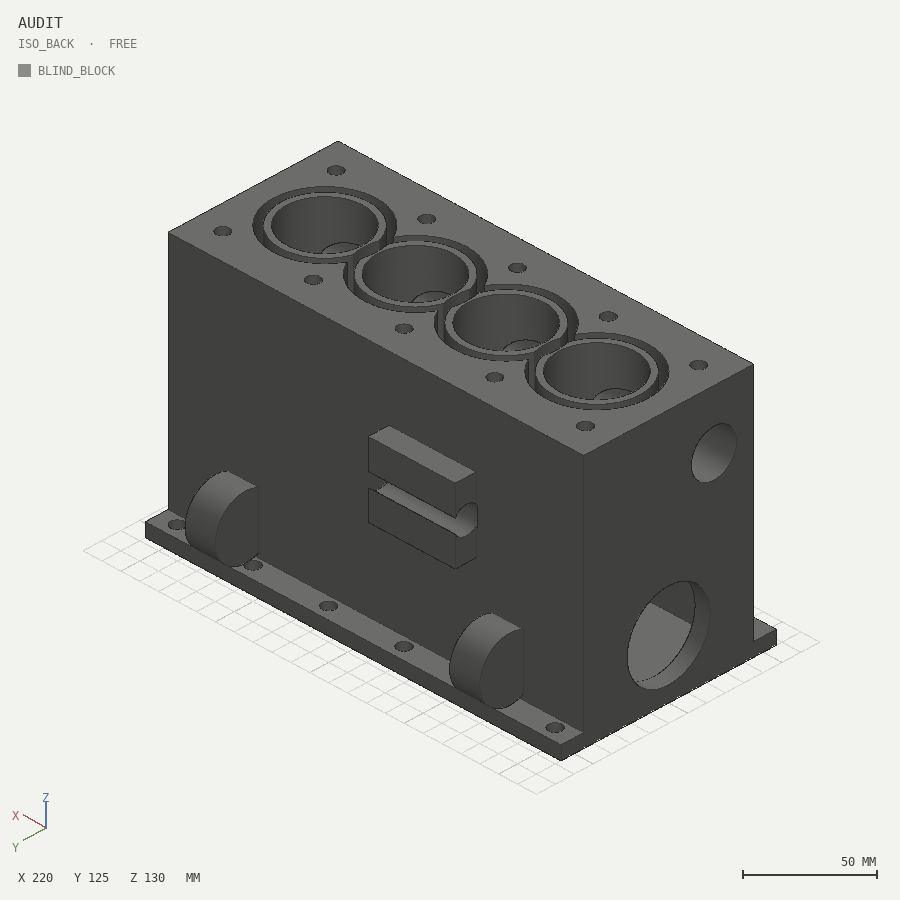

# Same prompt, with and without solidsight

**Prompt (identical for both sides):** *"make a detailed 3D model of an
inline-4 engine block"*.

Both sides use the same underlying model knowledge. The only variable is
tooling: no feedback loop vs. the solidsight loop. Nothing on the blind
side was touched after its single run, and both results are audited by the
same validator and rendered by the same renderer.

| | without (blind one-shot) | with (skill + loop) |
|---|---|---|
| environment | plain Python + trimesh, no renders, no report, no catalog | solidsight + SKILL.md |
| process | one pass, shipped on "exported, watertight=True" | feature spec, region-by-region, build+inspect each region |
| iterations | 1 (by definition — nothing to look at) | 4 (each guided by a finding) |
| artifact | [`blind/engine_blind.py`](blind/engine_blind.py) -> [`engine_blind.stl`](blind/engine_blind.stl) | [`skill/examples/07-engine-block`](../../skill/examples/07-engine-block) |

<p align="center">
  
  
</p>
<p align="center"><em>left: blind one-shot &nbsp;·&nbsp; right: same prompt through the loop</em></p>

## What the audit found in the blind output

The blind agent finished convinced it had succeeded — its only signal was
`exported True` (watertight). The same validator that checks every
solidsight build says otherwise:

| defect | evidence |
|---|---|
| head-bolt row at y=-30 drills straight into the cam tunnel (a fastener hole opening into a bearing bore) | `query ray 0 -30 132 0 0 -1`: continuous void from the deck down to z=89.6 |
| water-jacket walls down to **1.161 mm** — adjacent jacket rings overlap (ring r27 vs bore pitch 48) | print-safe audit: FAIL thin-wall at (-50.9, 1.2, 115) |
| oil-filter ports drilled along the wrong axis — the pad is sliced into slabs instead of ported | render (side face) |
| engine mounts are discs lying flat against the wall: no protrusion, no inclined faces, no tapped holes | render (side face) |
| missing functional features: liner steps, locating dowels, pan-rail gussets, coolant ports, chamfers | render / feature count vs. prompt |

Credit where due: the blind result is watertight, a single shell, and has
no sealed cavities — structurally competent. The gap is not competence,
it is **blindness**: every defect above is invisible without renders,
reports or queries.

## The with-tool side made the SAME kind of mistakes

That is the honest core of this comparison. Building the with-tool block,
the author's errors were equivalent — the loop just caught each one:

1. Coolant-port cutters missed the block entirely -> `noop-difference`
   warning with both bounding boxes.
2. Both engine mounts contained **sealed cavities** (the inclined tapped
   holes were buried under the surface) -> `internal-cavity` FAIL.
3. Jacket-to-bore wall of 0.75 mm -> `thin-wall` finding; the jacket was
   rebuilt as a stadium annulus (which is also how real siamese-bore
   blocks work).
4. Head-bolt drill points broke into the cam tunnel — the same defect as
   the blind side, found by the same `query ray`, fixed to a measured
   5.0 mm wall.

Same model, same kinds of blunders. **The tool is the difference between
shipping them and catching them.**

## Reproduce

```bash
cd docs/comparison/blind
python engine_blind.py                       # the one-shot
solidsight build audit.py --views iso,iso_back --slice x=24   # the audit
solidsight build audit.py --print-safe --out out_ps           # printability
solidsight query audit.py ray 0 -30 132 0 0 -1                # the breakthrough
```
