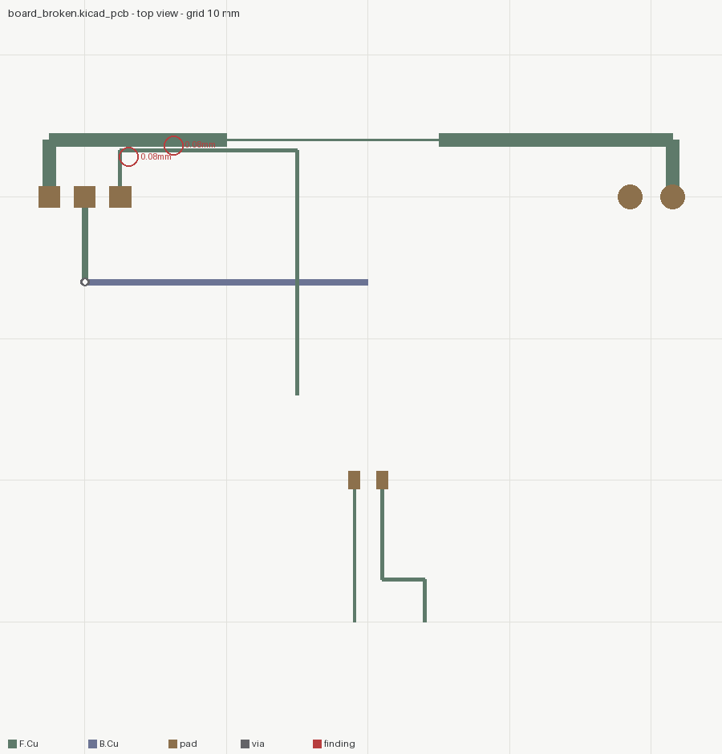

# pcbsight

**PCB review built exclusively for AI agents.** A `.kicad_pcb` in;
exact connectivity, clearance, current and pair findings out, with
coordinates.

A layout is judged by eyeballing the copper. But an open net is a
union-find question over copper that actually touches, a clearance is a
segment-to-segment distance minus the widths, current capacity is
IPC-2221 arithmetic at the net's narrowest point, and differential-pair
skew is a subtraction. None of it needs eyes.

```bash
pip install "git+https://github.com/VortexJer/SolidSight#subdirectory=pcbsight"

pcbsight inspect board.kicad_pcb --clearance 0.15
# -> [FAIL] net 'GND' is 2 separate island(s) - unconnected pad(s): J1.2
# -> [FAIL] track-track: '+5V' to 'SIG' at 0.08 mm (required 0.15)
#           where: F.Cu near (28.75, 16.37)
# -> current: '+5V' min width 0.2 mm -> 0.746 A at dT=10 C (external)
# -> pair: USB_P / USB_N - skew 3.0 mm (~19.8 ps on FR4)
# -> out/board.png   (copper as drawn, findings circled in red)

pcbsight impedance 0.3 0.2      # ~51 ohm microstrip (IPC-2141 estimate)
```

Exit codes: 0 ok, 1 bad input, 2 a FAIL-level finding. Deterministic.

## What it measures

| | |
|---|---|
| **connectivity** | union-find over copper that geometrically touches (tracks by width, vias across layers, pads by extent): islands per net, the unconnected pads named |
| **clearance** | exact segment distances minus copper widths, per layer, different nets only; FAIL below 50 % of the rule (etch-short territory), warn above |
| **current** | IPC-2221 external/internal curve at the net's *narrowest* track, with copper weight and dT stated |
| **diff pairs** | found by net name (`_P/_N`, `+/-`, deduped); width match and length skew in mm and ~ps |
| **impedance** | IPC-2141 microstrip estimate, labelled an estimate |

Footprint pads are composed through the footprint's placement —
rotation included, because a pad's `(at ...)` is local and skipping the
rotation silently misplaces every pad of every rotated footprint
(`test_rotated_footprint_pads_are_composed`).

## Proof it works: known ground truth

`examples/01-board` is a small 2-layer board generated twice: clean, and
with four defects injected at exact magnitudes.

| injected | measured |
|---|---|
| GND bottom trace stops 18.5 mm short of J1 | `[FAIL] net 'GND' is 2 separate island(s) ... unconnected pad(s): J1.2` |
| SIG routed 0.08 mm from +5V | clearance **0.08 mm** (exact), coordinates given |
| +5V necked to 0.2 mm | `min width 0.2 mm -> 0.746 A` (the 1.0 mm run: 2.39 A, on the published IPC curve) |
| USB pair: one side +3 mm detour, width 0.25 vs 0.3 | skew **3.0 mm** (~19.8 ps), `width_matched: false` |

The clean board reports **OK, exit 0, zero findings** — asserted in the
tests, both directions.

<p align="center">
  
</p>
<p align="center"><em>the broken board: the neck in the top trace, the blue GND run stopping short, the 0.08 mm findings circled</em></p>

## Two of its own defects the example caught

1. The first "clean" board routed +5V straight through the GND and SIG
   pads — pcbsight flagged its own reference at 0.0 mm clearance. The
   example was wrong; the check was not. It stays in the generator as a
   comment.
2. `USB_P/USB_N` matched two suffix rules (`_P/_N` and `P/N`) and was
   reported twice. Pairs are now deduped by the net pair, and the test
   asserts exactly one.

## Honest limitations

- **Zones/pours are not read**: a net routed only through a copper pour
  will read as open here. Where pours carry nets, confirm in KiCad's
  own DRC — this tool complements it, it does not replace it.
- Current numbers assume a lone trace in still air (that is what
  IPC-2221 tabulates); planes and vias change the real number.
- The impedance estimate is IPC-2141 (~10 %); controlled impedance
  needs the fab's field-solved stackup.
- Arcs, curved traces, keepouts and mask/paste layers are not parsed.

Siblings, same philosophy: [solidsight](../README.md) (geometry — export
the board outline there to check the enclosure fit),
[animationsight](../animationsight/README.md),
[texturesight](../texturesight/README.md),
[shadersight](../shadersight/README.md).

## License

MIT
