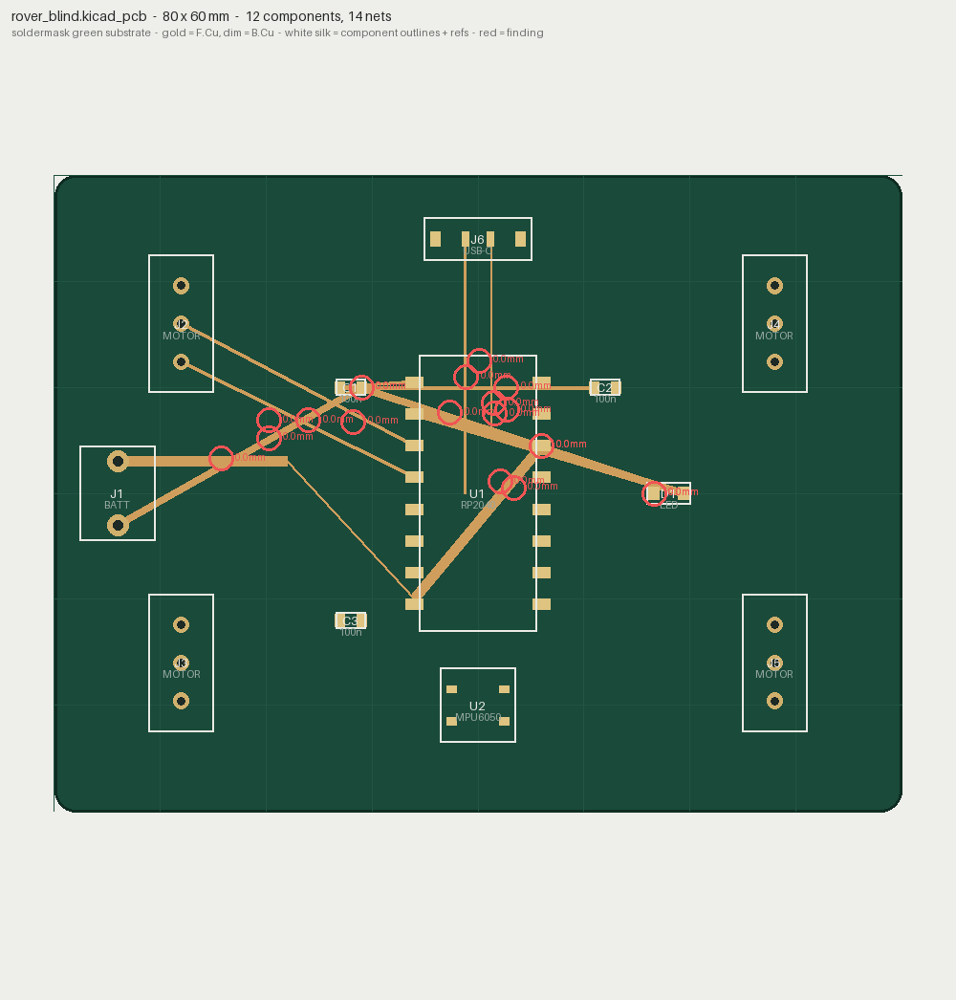
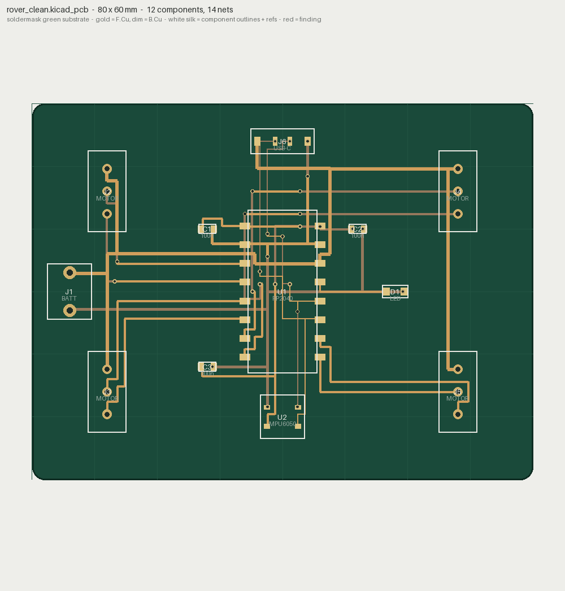

# 02 — A 4-motor rover controller (blind vs the loop)

The complex example: a real rover board — MCU (RP2040), IMU
(MPU6050), four motor connectors, a battery entry, a USB-C data pair,
a status LED, three decoupling caps — **14 nets, 13 components**. Built
twice, the way solidsight's engine block is:

- **`rover_blind.kicad_pcb`** is routed the way a fresh agent would with
  only the netlist and no way to SEE the copper: short diagonals laid
  between pads it cannot tell are in the way. It ships the defects that
  come *from* being blind.
- **`rover_clean.kicad_pcb`** is the same board taken to **zero
  findings** — routed by a real 2-layer maze router that reads each
  pad's actual position from pcbsight and keeps a clearance halo around
  everything it lays down.

```bash
python make_rover.py
pcbsight inspect rover_blind.kicad_pcb   # FAILED
pcbsight inspect rover_clean.kicad_pcb   # OK
pcbsight diff rover_blind.kicad_pcb rover_clean.kicad_pcb
```

## Before (blind) vs after (the loop)

<p align="center">
  
  
</p>
<p align="center"><em>left: routed blind — diagonals crossing pads, findings circled in red, three motors and the IMU never reached. right: a clean 2-layer route, every net closed. Same components, same nets.</em></p>

The blind board is not a strawman — it is exactly what routing without
sight produces: **12 of 14 nets left open, 26 clearance violations**,
the USB pair swapped and unmatched, the battery rail necked to 0.25 mm.
None of it is visible as "wrong" without measuring the copper.

## The diff tells the whole repair

```
pcbsight diff rover_blind.kicad_pcb rover_clean.kicad_pcb
  tracks: 12 -> 113          vias: 0 -> 27
  net 'GND':    6 island(s) -> 1
  net 'USB_DP': 4 island(s) -> 1
  net 'USB_DM': 4 island(s) -> 1
  net 'M2_A' .. 'M4_B':      2 island(s) -> 1   (each motor pair reached)
  clearance findings: 26 -> 0
  ... every net-open and clearance finding GONE
```

## Why the render looks like a board

Every component carries its silkscreen body, reference (U1, J2, D1...)
and value (RP2040, MOTOR, LED...); the substrate is the real Edge.Cuts
outline; gold is the front copper, dim gold the back. That is the point
of the render overhaul — a PCB review has to *look* like a PCB, or the
findings float in the void.

The clean side is genuinely routed, not decorated: `_router.py` is a
small Lee/BFS maze router (two layers, vias, a clearance halo) so the
"after" is a board that actually connects — the same standard the
family holds everywhere: the fixed reference must really be fixed.
