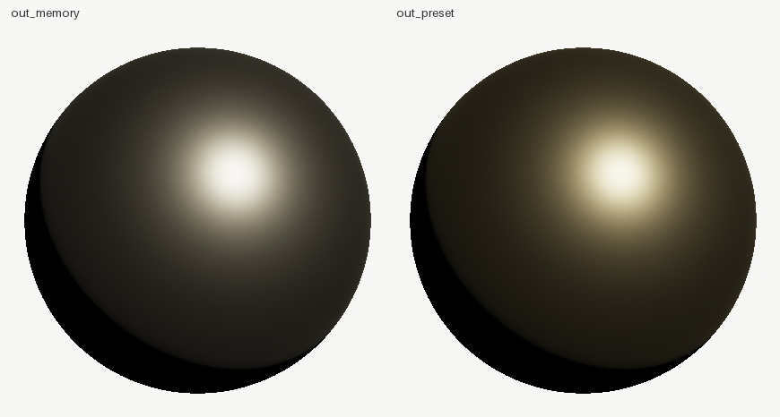

# shadersight

**Shader review built exclusively for AI agents.** A material or a node
graph in; physics verdicts, graph analysis and exact numbers out.

A shader is judged by rendering a sphere and squinting. But what is
actually *wrong* with a material is physics — laws, not opinions:

- **energy conservation** — a passive surface must not reflect more
  light than it receives (the white furnace test, swept over view
  angles because grazing is where materials cheat);
- **Helmholtz reciprocity** — `f(wi, wo) == f(wo, wi)`, always;
- **positivity** — a BRDF is never negative.

All three are integrals and identities over the hemisphere. So compute
them. And a node graph's problems are graph theory: cycles, dead nodes,
per-pixel cost.

```bash
pip install shadersight

shadersight material --base-color 0.7,0.4,0.15 --roughness 0.35 --metallic 1
# -> energy: max albedo 0.72 at 85 deg -> CONSERVES (grid 64x128, 12 views)
# -> reciprocity: max rel error 0.0 -> OK
# -> out/albedo_curve.png (the verdict, plotted against the 1.0 ceiling)
# -> out/preview.png      (the human-facing sphere)

shadersight graph shader_graph.json
# -> [FAIL] 2 node(s) form a feedback cycle: nodes: mul, add
# -> [WARN] 2 node(s) do not reach the output
# -> cost: ~340 ALU-equiv/pixel, 3 texture fetch(es)
```

Or as a Claude Code plugin:

```
/plugin marketplace add VortexJer/AISight
/plugin install shadersight@aisight
```

(the plugin carries the skill; the CLI it drives still comes from pip)

Everything is deterministic (fixed-seed sampling; the resolution is in
the report, because a physics claim without its resolution is not a
claim).

## What it generates

Real committed output from [`examples/01-graphs`](examples/01-graphs)
(a bronze at roughness 0.35) and [`examples/02-gold`](examples/02-gold):

<p align="center">
  
  
</p>
<p align="center"><em>preview.png (the human-facing sphere) and albedo_curve.png (the verdict: directional albedo vs the red 1.0 energy ceiling)</em></p>

## Before / after: one turn of the loop

[`examples/03-boosted`](examples/03-boosted): the "specular boost"
slider every engine exposes, measured. Copper at boost 1.8 **FAILS** —
it reflects 1.72x the light it receives, from every angle:

```
[FAIL] the material reflects 1.71766x the light it receives at 0.0 deg
       try:   the boost multiplier IS the violation: boost=1.8 manufactures
              energy by construction - set it to 1.0 and restyle with
              roughness/F0 instead
```

Apply the `try:` line and prove it:

```
shadersight diff out_boosted out_physical
  boost: 1.8 -> 1.0
  max albedo: 1.71766 (at 0.0 deg) -> 0.95172 (at 0.0 deg)
  GONE [energy-not-conserved] the material reflects 1.71766x the light it receives
  compare: out_physical/compare.png
```

<p align="center">
  
</p>
<p align="center"><em>the before: the whole albedo curve floats above the red 1.0 ceiling</em></p>

<p align="center">
  
</p>
<p align="center"><em>before | after — the boosted copper is brighter, and a lie the lighting pipeline pays for later</em></p>

And [`examples/02-gold`](examples/02-gold) is the other half of the
craft: a "gold-ish" colour from memory vs the measured preset — both
pass the physics, only one is gold. Being physical and being right are
different questions; that is why the presets exist.

<p align="center">
  
</p>
<p align="center"><em>left: the guess (reads as pewter) · right: measured gold</em></p>

And on the graph side, the broken example graph against the clean one is
the whole review loop in four lines:

```
shadersight graph broken_graph.json   ->  FAILED (cycle: mul, add; dangling
                                          'missing'; 2 dead nodes)
# fix the graph in the DCC tool, re-export, then:
shadersight graph clean_graph.json    ->  OK  (~340 ALU-equiv, 3 fetches)
```

## Blind vs verified: the production material set

[`examples/04-materials`](examples/04-materials) is the full study:
eight production materials plus a layered car-paint graph, authored
once by a cold-context agent with **no tools** (JSON from memory, one
shot) and once with this tool in the loop. Twist: the blind side was
good — measured F0s from memory, refused the "boost the highlights"
bait — and the audit's only FAIL turned out to be **estimator noise in
the tool itself** (an exactly-F0=1 gold read 1.004 at fast quality).
That became a tool fix: over-limit views are re-measured at 16x
samples before any material is condemned, with the tolerance
calibrated against an exact-limit metal. The graph side: verified
sound (22/22 reachable, acyclic), then baked from 436 to **204
ALU/pixel** by turning the procedural flake chain into one texture
fetch.

<p align="center">
  
  
</p>
<p align="center"><em>gold's directional albedo vs the 1.0 ceiling — left: the fast-quality audit reads 1.004 and condemns a physically exact material · right: re-measured at 16x samples, it passes. The defect was in the tool, and the study is what found it.</em></p>

Full numbers in the example's README.

## Proof it works

The tests hold the tool to the laws, in both directions:

- GGX's normal distribution integrates to 1 over the hemisphere
  (checked numerically, not trusted).
- A smooth white metal mirror measures albedo **1.00 at every angle** —
  the case a naive uniform-grid integrator gets catastrophically wrong
  (it read 0.02 or 1.19 depending only on resolution; the tool uses
  multiple importance sampling precisely because its own first
  integrator failed this test).
- A hacked material that reflects 3x its input is **FAILED** at 2.70.
- A material with a view-dependent asymmetric term is caught by the
  reciprocity check.
- The clean example graph reports zero findings; the broken one (cycle,
  dead branch, dangling reference — all by construction) reports
  exactly those three.

## A bug this tool found in its own reference material

The first version coupled diffuse and specular the way most engines do:
`Lambert * (1 - F) + GGX`. shadersight measured **its own material at
1.478x the energy ceiling at 85°** — the naive coupling genuinely
violates conservation at grazing angles, where the specular reflects
nearly everything while the diffuse lobe keeps contributing. The
reference now uses Ashikhmin-Shirley coupled diffuse (reciprocal,
rolls off toward grazing) and sweeps under 1.0 across the whole
roughness x metallic x angle space, asserted in
`test_physical_materials_conserve_energy`.

That defect ships in real engines. Now there is a number for it.

## Honest limitations

- The material model is standard metallic-roughness PBR — the model
  ~90 % of real shaders are. It does not parse GLSL/HLSL.
- Energy *loss* at high roughness is reported as a warning and labelled
  what it is: the known single-scattering GGX deficit, not a defect.
- The cost model is orders of magnitude (a fetch ~100x an add), counted
  over live nodes only. It compares graphs; it does not predict frame
  time on hardware it has never seen.

Siblings, same philosophy: [solidsight](../solidsight/README.md) (geometry),
[animationsight](../animationsight/README.md) (motion),
[texturesight](../texturesight/README.md) (UVs/textures).

Leaving: `shadersight uninstall` removes this tool's skill and package.
`pip install aisight && aisight uninstall` removes the whole family —
every skill, every package and the plugin marketplace. See
[aisight](../aisight/README.md).

## License

MIT
