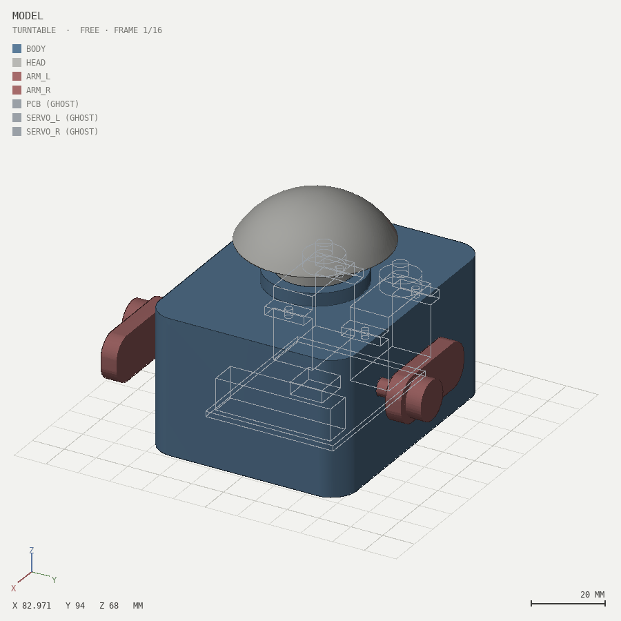
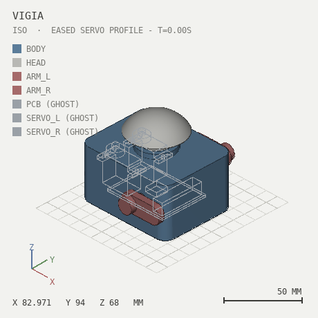
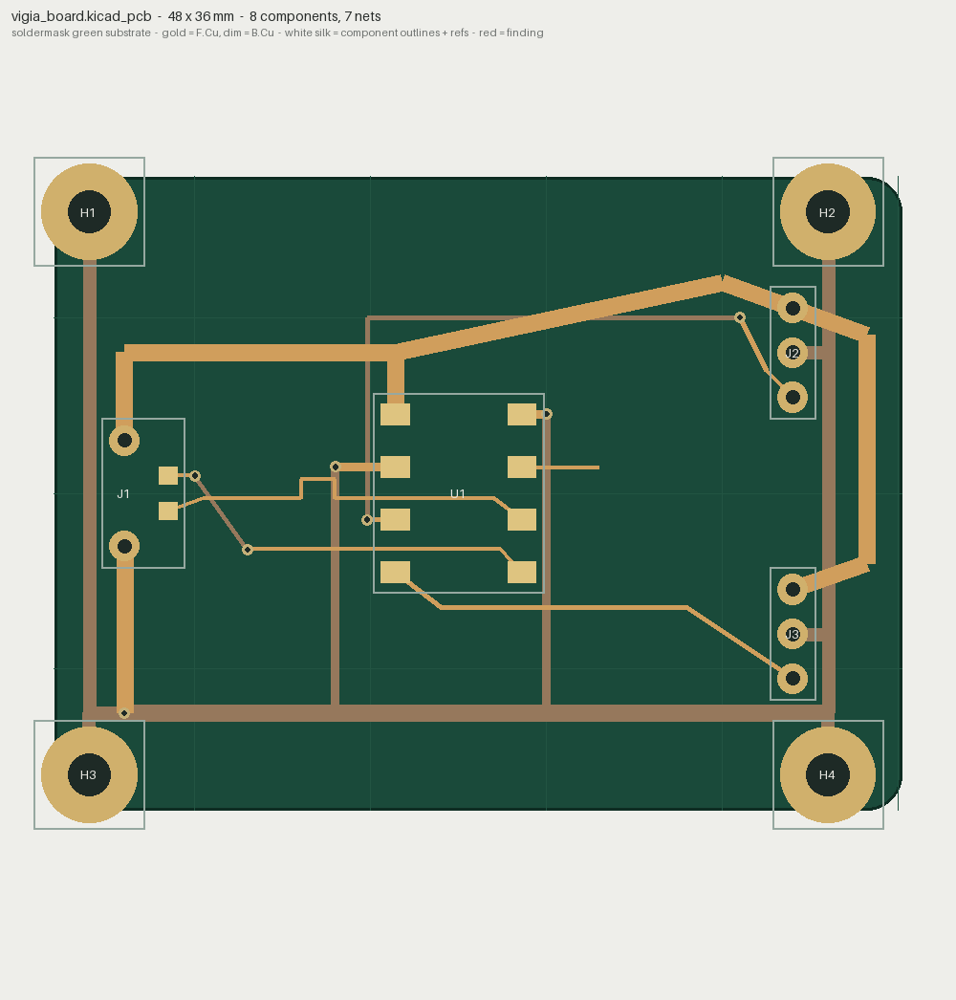
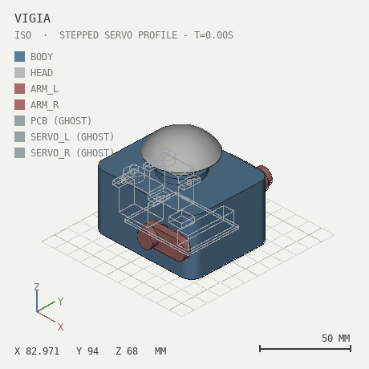

# Vigía — one robot through all five tools

A desk robot taken from nothing to a printable enclosure, a routed
controller board, a simulation-ready URDF, a textured game asset,
validated materials and a reviewed animation — **entirely by an AI
agent, entirely through measurements**. Every number below comes from a
committed report in this directory; every image was generated by the
tools.

The point is not the robot. The point is that **every stage caught real
defects the agent could not see**, and every fix ends in a diff that
proves it. Five tools, one loop.

<p align="center">
  
  
</p>
<p align="center"><em>the assembly (PCB and servos as X-ray ghosts: measured, never printed) and its exploded view</em></p>

<p align="center">
  
  
</p>
<p align="center"><em>Vigia spinning (solidsight <code>--turntable --gif</code>) and performing its greeting gesture — the real robot posed by the same servo profile animationsight reviews. An animation cannot be read from a still.</em></p>

## Stage 1 — the board (pcbsight)

[`board/make_board.py`](board/make_board.py) writes a 50×40 controller:
MCU, USB entry, two servo headers, four M3 mounting pads. The first
routing was confidently wrong — **31 findings**: both USB nets open
*with their endpoints swapped*, the +5V trunk crossing the GND tie at
0.0 mm, a GND spine drawn under other nets' through-hole pins.

Four iterations against `pcbsight inspect` later:

```
pcbsight diff vigia_board_v1.kicad_pcb vigia_board.kicad_pcb
  net 'USB_N': 2 island(s) -> 1
  net 'USB_P': 2 island(s) -> 1
  clearance findings: 31 -> 0
  pair USB_P / USB_N: skew 0.733 -> 0.012 mm
```

The pair was length-matched with a serpentine sized from the measured
skew (2.212 mm owed → 2.2 mm jog → 0.012 mm left).

<p align="center"></p>

## Stage 2 — the enclosure (solidsight)

The case does not copy the board's dimensions — it **imports pcbsight
and reads them**:

```python
from pcbsight import parse_board
_BOARD = parse_board(... / "vigia_board.kicad_pcb")
MOUNTS = sorted(p.at for p in _BOARD.pads if p.ref.startswith("H"))
USB_Y  = next(p.at[1] for p in _BOARD.pads if p.ref == "J1" ...)
```

The standoffs sit at the board's own mounting pads; the USB window is
centred on the board's own J1. Change the board, rebuild the case, and
the mechanics follow. The electronics enter as **ghosts** with declared
`expect()` relations — and the reports ran the design through five
iterations of caught defects: servos placed exactly where the servo
*headers* are, a 0.5 mm hover between board and standoffs (the
`touching` spec failed), a neck ring floating over the open shell
("body is 2 disconnected pieces"), two servos that measurably do not
fit side-by-side (32.2 mm long, proven by collision, laid lengthwise).

Final state, from `report.json`:

```
pair 'body' <-> 'pcb':   touching, clearance 0.0 mm  [spec MET: touching]
pair 'body' <-> 'head':  clear, clearance 0.3 mm     [spec MET: 0.2..1 mm]
pair 'body' <-> 'arm_l': clear, clearance 0.25 mm    [spec MET: 0.1..2 mm]
... 6/6 declared specs MET, 0 warnings
```

And because the parts carry `joint()` declarations:

```
robot: out/robot/model.urdf  (7 links, 6 joints, exact inertials)
joint head_pan    (revolute, -120..120 deg): FREE over the whole range
joint arm_l_pitch (revolute,  -40..100 deg): FREE over the whole range
joint arm_r_pitch (revolute,  -40..100 deg): FREE over the whole range
```

## Stage 3 — the game asset's UVs (texturesight)

The face plate ships to the game engine as an unwrapped OBJ. The first
unwrap had the eye bezel's island **flipped** (normal maps would sample
mirrored — lighting wrong in a way no texture edit can fix) and packed
at half density:

```
[FAIL] 2 face(s) have inverted UV winding
islands: #4 is the sparsest (8.53 px/unit, 2 face(s)) vs #0 (13.3)

texturesight diff out_broken out_fixed
  flipped faces: 2 -> 0
  density: spread 1.56x -> 1.28x
  GONE [uv-flipped-faces] 2 face(s) have inverted UV winding
```

## Stage 4 — the materials (shadersight)

Body: measured aluminum preset, roughness 0.45 — conserves at 0.958.
The copper accent got the classic "make it pop" boost, and paid for it:

```
--preset copper --boost 1.6  ->  FAILED: max albedo 1.53269, VIOLATES
--preset copper              ->  OK:     max albedo 0.95793

shadersight diff out_accent_v1 out_accent
  boost: 1.6 -> 1.0
  GONE [energy-not-conserved] the material reflects 1.53269x the light it receives
```

<p align="center"></p>

## Stage 5 — the gesture (animationsight)

Vigía does not jump — it has three servos. Its greeting (look left,
look right, wave the left arm twice) is authored as servo keyframes on
**the same joint tree the URDF declares** (head_pan, arm_l_pitch,
arm_r_pitch), and written twice:

- `gesture_stepped.bvh` — what naive servo code does: write the target
  angle and wait. Every keyframe is an instant step.
- `gesture_eased.bvh` — the same keyframes through a smoothstep motion
  profile.

animationsight measures what the clip *asks of the hardware*:

```
stepped: 18 discontinuity events; head peak 3600 deg/s   [WARN pops]
eased:    0 discontinuity events; head peak  299 deg/s   OK
```

An SG90-class servo tops out near **600 deg/s** — the stepped profile
demands six times that, so the physical robot would lag, slam and buzz.
The eased profile stays comfortably inside spec. That is a servo review
with numbers, not vibes.

<p align="center">
  
  
</p>
<p align="center"><em>the real robot driven by both profiles (rendered by solidsight at the swept angles): stepped snaps between poses; eased moves like a machine that respects its motors</em></p>

## The scoreboard

| stage | tool | caught | proven by |
|---|---|---|---|
| board | pcbsight | 31 findings: swapped open USB nets, 0.0 mm shorts, pair skew | diff: 31 → 0, skew 0.012 mm |
| enclosure | solidsight | 5 iterations: servo-vs-header collisions, 0.5 mm board hover, disconnected neck ring, servos that don't fit | 6/6 specs MET, 0 warnings |
| robot | solidsight | a 4-root joint forest (fixed joints added) | URDF 7 links; all sweeps FREE |
| UVs | texturesight | flipped bezel island, starved packing | diff: flipped 2 → 0 |
| materials | shadersight | boost 1.6 = albedo 1.53 (energy from nothing) | diff: GONE, conserves at 0.958 |
| gesture | animationsight | stepped servo profile: 18 pops, 3600 deg/s demanded of a 600 deg/s servo | eased: 0 pops, 299 deg/s |

Every one of those defects is invisible in a still image and exact in a
report. That is the family's whole thesis, demonstrated on one object.

## Reproduce

```bash
cd showcase/board  && python make_board.py && pcbsight inspect vigia_board.kicad_pcb
cd ../robot        && solidsight build model.py --exploded --stl --glb
                     solidsight robot model.py --sdf && solidsight motion model.py
cd ../asset        && python make_faceplate.py && texturesight inspect --mesh faceplate_fixed.obj
cd ../materials    && shadersight material --preset copper --roughness 0.25
cd ../motion       && python make_gesture.py && animationsight inspect gesture_eased.bvh --kind oneshot
                     python render_gesture.py   # the robot performing it, as GIFs
```
