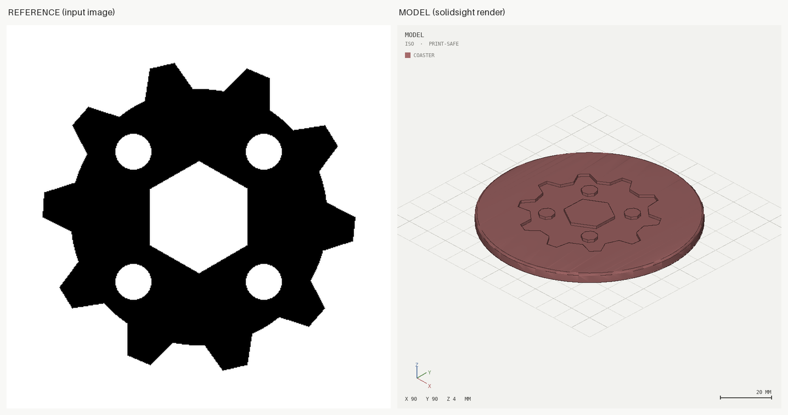

# 08 — From an image: emblem engraved on a coaster

**Commission:** *"here's my emblem (emblem.png) — engrave it on a
coaster"* — the input is a picture, which is exactly the case where an
agent's eyes and the kernel's exactness have to be split apart.

## What this example shows

- `image_outline("emblem.png", width=70)` traces the artwork into an
  exact sketch: the hex hole and the four windows survive as holes
  (even-odd fill), and no one re-drew a 10-tooth outline by hand.
- The real size is the agent's judgment (`width=70` on a 90 mm
  coaster, tagged `[standard]` in the model header), not the image's:
  pixels carry no millimetres.
- `--ref emblem.png` writes `out/renders/00_reference_vs_render.png`
  — the reference next to the render, to LOOK at and compare.
- `features=[...]` on emit() records the engraving semantically, so
  report.json says what the pocket *is*, not just that it exists.

```bash
solidsight build model.py --print-safe --ref emblem.png --stl
```

Result: `ok` in print-safe, one shell, min wall 2.8 mm (the floor left
under the 1.2 mm engraving).

## The reference-vs-render sheet

<p align="center">
  
</p>

## A real bug this example caught

The first build of this model rendered phantom stripes across the flat
top of the coaster. They were not geometry: subtracting a complex
outline makes manifold retriangulate the top face into long slivers,
and a sliver's normal tilts on float noise, so the renderer's crease
and silhouette tests fired on nothing. Fixed at the root in
`render.py` (`_sound_faces`: an edge is only trusted when both its
triangles have a real altitude), pinned by
`test_slivers_do_not_fake_edges_on_a_flat_face`.

Worth stating plainly: the tool found it the same way it finds every
other defect — by rendering and looking.
