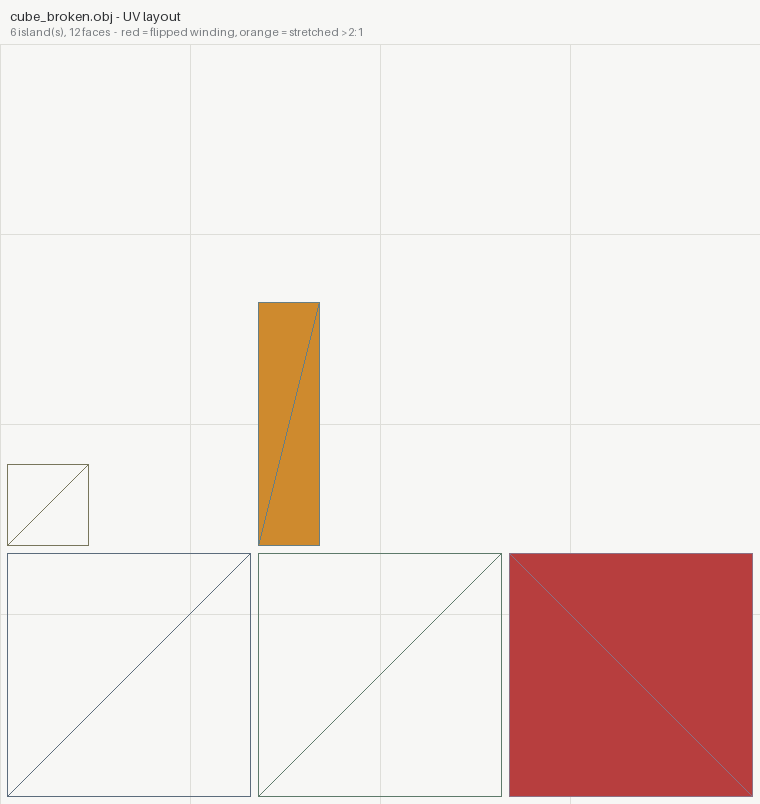
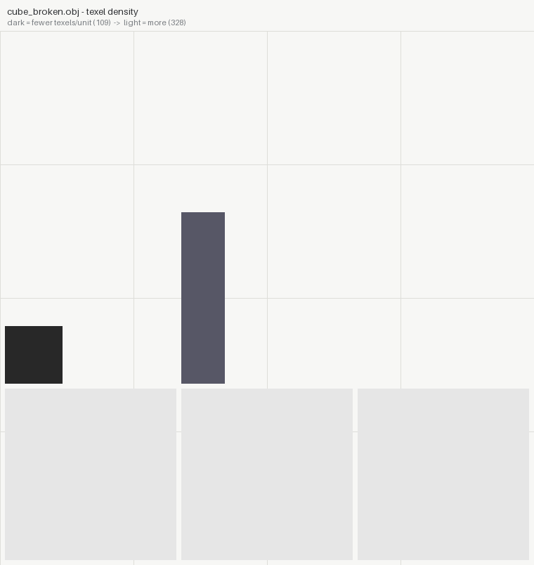
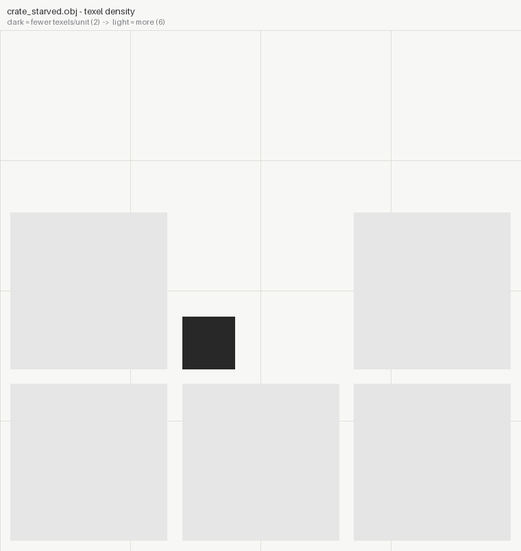
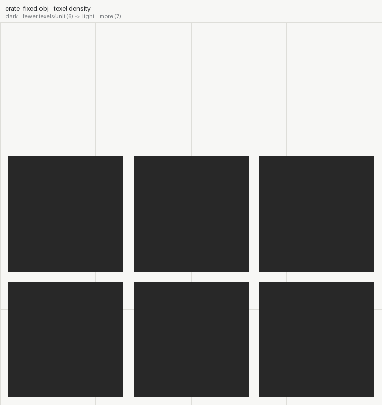

# texturesight

**UV and texture review built exclusively for AI agents.** A mesh and
its maps in; exact measurements, located findings, and evidence renders
out.

Texture work is judged by putting a checker on the model and looking, or
tiling a plane and squinting. An agent can do neither — and it turns out
none of it needs eyes. Texel density is UV area against 3D area. Stretch
is the singular values of the per-face UV Jacobian. A seam is an edge
whose two faces land in different UV islands. A normal map is either
unit-length vectors or it is broken.

```
model.obj + maps  ->  texturesight inspect  ->  report.json + uv_layout.png  ->  fix  ->  diff
```

## What it measures

| | |
|---|---|
| **texel density** | px per world unit, area-weighted, with the spread across the mesh |
| **distortion** | per-face anisotropy from the UV Jacobian's SVD; flipped winding |
| **islands & seams** | UV islands vs mesh shells; seams counted from the topology, with their 3D length |
| **packing** | utilization of the 0..1 square, overlap between islands, out-of-bounds faces |
| **tiling** | the wrap jump judged against the texture's *own* pixel-to-pixel variation |
| **repetition** | autocorrelation peak and offset (reported, not moralised about) |
| **normal maps** | unit length, Z channel validity, green convention (OpenGL/DirectX) |
| **data maps** | range used, distinct levels, constant/quantised detection, grayscale check |
| **compression** | codec blocking, required on both axes because a codec's grid is square |

Findings carry `where` and a `try:`. Everything is deterministic.

## Quickstart

```bash
pip install "git+https://github.com/VortexJer/AISight#subdirectory=texturesight"

texturesight inspect --mesh model.obj --texture-px 2048
# -> out/report.json
# -> out/uv_layout.png    (islands; red = flipped, orange = stretched)
# -> out/uv_density.png   (texel density painted per face)

texturesight inspect --texture rock_normal.png       # kind guessed from the name
texturesight inspect --texture rough.png --kind roughness
```

Exit codes: 0 ok, 1 bad input, 2 a FAIL-level finding.

## Proof it works: known ground truth

`examples/01-cube` is synthetic on purpose — every defect is injected by
`make_assets.py` with a known magnitude, so the tests can assert the
*right* answer rather than merely *an* answer.

| injected | measured |
|---|---|
| one face's UVs squashed to 1/4 in u | anisotropy max **4.0:1** (exact) |
| one island scaled to 1/3 | density spread **3.0x**, min **109.23** of 327.68 px/unit (exact) |
| one face's UV winding reversed | `[FAIL] 2 face(s) have inverted UV winding` |
| one island moved outside 0..1 | `2 face(s) fall outside`, uv bbox `[0.01, 0.01, 1.99, 0.66]` |
| a normal map gamma-encoded (sRGB'd) | `[FAIL] 88.2% of texels are not unit-length (mean 1.1612)` |
| a texture's edges darkened | `does not tile: the wrap jump is 34.74x the texture's own variation` |
| a roughness map quantised to 6 levels | `only 4 distinct levels: it was quantised somewhere` |

And the clean cube reports **anisotropy exactly 1.0, density spread
exactly 1.0x, zero findings, exit 0**.

<p align="center">
  
  
</p>
<p align="center"><em>the broken cube: red = flipped winding, orange = the 4:1 stretch, the small island = the density hole (the sixth is off-canvas, which is the out-of-bounds evidence)</em></p>

## Three bugs the clean reference caught

The clean cube exists to fail loudly when the maths is wrong, and it
did — all three of these were found before shipping, by the reference,
not by a user:

1. **A transposed matrix in the UV Jacobian** reported a *conformal* map
   (square UVs on square faces) as 2.618:1 stretched. Every asset would
   have been accused of stretch.
   (`test_uniform_scale_is_conformal`)
2. **Codec blocking was tested on one axis**, so a posterised roughness
   map — contour bands that happen to correlate with x but not y — was
   reported as JPEG artifacts. A codec's grid is square; both axes must
   agree. (`test_banding_is_not_reported_as_codec_blocking`)
3. **Repetition warned on every tiling texture.** A texture that tiles
   is periodic *by definition*. It is now reported as a measurement, and
   only warned about for a tight repeat inside a single tile.

False positives are how a tool loses the right to be believed, so they
are treated as bugs of the same severity as false negatives.

## Before / after: one turn of the loop

[`examples/02-crate`](examples/02-crate) is the classic layout edit gone
wrong: the lid's island packed at 1/3 scale. Invisible on the model
until the texture is painted — then the lid is blurry forever. The
finding names the island, its place, and the factor:

```
islands: #4 is the sparsest (2.05 px/unit, 2 face(s)) vs #0 (6.14)
[WARN] texel density varies 3.0x across the mesh
       where: island #4 at uv (0.35, 0.35)-(0.45, 0.45): 2.05 px/unit vs 5.46 mesh mean
       try:   scale island #4 up ~2.7x in the UV editor
```

Apply the `try:` line, re-inspect into a new out dir, and prove it:

```
texturesight diff out_starved out_fixed
  density: mean 5.46 -> 6.14 px/unit; spread 3.0x -> 1.0x
  GONE [texel-density-uneven] texel density varies 3.0x across the mesh
```

<p align="center">
  
  
</p>
<p align="center"><em>before: island #4 dark (starved) · after: uniform density</em></p>

## Blind vs measured: the hero crate

[`examples/03-crate-hero`](examples/03-crate-hero) is the full study: a
576-triangle sci-fi supply crate, unwrapped and textured twice — once
by a cold-context agent with **no tools at all** (numpy + PIL, one
shot), once through this tool's loop. The blind build's painted maps
survive the audit untouched; its little UV mapper hides three real
bugs: **148 flipped faces (FAIL), 7.35:1 stretch, 54x texel density
spread**. The after build imports the blind generator, rewrites only
the mapper, and lands at 0 flips, 1.005 p95 anisotropy, 3.35x spread —
with the two remaining warnings explained as intent (trim-sheet
overlap, downres'd hidden faces).

<p align="center">
  
  
</p>
<p align="center"><em>left: the blind unwrap — 148 flipped faces in red, islands stacked 336 deep · right: the rewritten mapper — 0 flips, welded shells, 92% packing</em></p>

<p align="center">
  
  
</p>
<p align="center"><em>texel density painted per face — blind: a 54x spread between the best- and worst-fed faces · after: 3.35x, with the hidden faces' downres declared as intent</em></p>

Full numbers in the example's README.

## Reading the results honestly

Several findings are only defects **in context**, and the tool says so
rather than pretending:

- **Out-of-bounds UVs** are correct for tiling and UDIMs.
- **Overlap** is correct for mirrored geometry sharing texture.
- **Repetition** is correct for a brick or a weave.
- **The green convention is a guess** from the map's own statistics — no
  format records it. Confirm against what the engine expects.

## Scope

Reads OBJ (with UVs) and standard image formats.

Does **not** do: unwrapping, packing, baking, painting, or fixing
anything — it audits; you fix it in the tool that made it. It does not
judge whether a texture is beautiful, only whether it is correct.

Siblings, same philosophy: [solidsight](../solidsight/README.md) (3D geometry),
[animationsight](../animationsight/README.md) (motion clips).

## License

MIT
