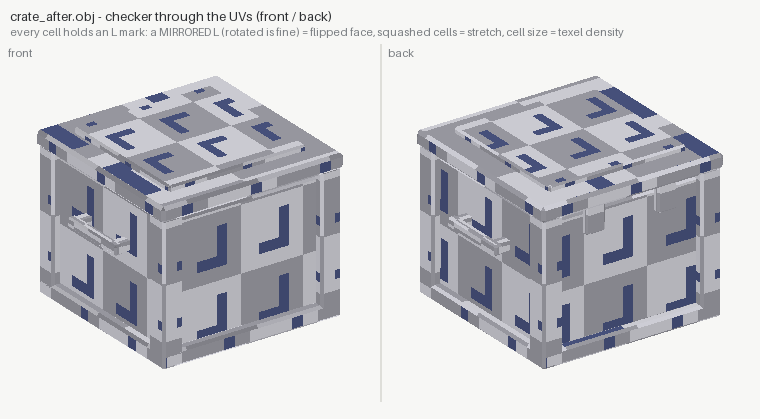

# 03 — hero crate: blind vs measured

The commission: a hero sci-fi supply crate — chamfered body, corner
posts, skirt, lid, handles, latches (576 tris) — fully unwrapped and
textured (albedo + tangent normal + roughness, 1024²), procedurally,
no DCC tools.

- **`blind/`** — a cold-context agent with no tools: numpy + PIL, no
  viewer, no validation, one shot. (`blind/make_blind.py`)
- **`crate_after.obj`** — the same build through the texturesight
  loop. `make_after.py` *imports* the blind generator — same geometry,
  same atlas, same painted maps — and rewrites only the UV mapper, one
  fix per measured finding.

| | blind | after |
|---|---|---|
| flipped UV faces | **148 (FAIL)** | 0 |
| anisotropy (median / p95) | 2.61 / 7.19 | 1.001 / 1.005 |
| texel density spread | 54.1x | 3.35x |
| UV islands / mesh shells | 336 / 336 | 47 / 16 |
| packing | 351% of the square | 92% |
| verdict | `FAILED` | `WARNINGS` (2, both intent — see below) |

| blind — red = flipped, orange = stretched | after |
|---|---|
|  |  |

New to UVs? `correspondence.png` shows which flat shape is which 3D
piece (same colour on both sides), and `checker_preview.png` puts the
defects on the model where any eye can see them:

<p align="center">
  
</p>
<p align="center">
  
</p>

## What the blind agent got right

A lot. The geometry ran clean first try: winding enforced by Newell
normals, watertight parts, a disciplined region table where mesh and
painter iterate the SAME rectangles so content lands on the right
faces by construction. The painted maps survive the audit untouched:
normal map unit-length (|n| mean 1.0), OpenGL green confirmed by
measurement, roughness well-ranged (0.24..0.86, 158 levels). The after
build ships those exact pixels.

## What it could not see — three bugs in one small mapper

**148 flipped faces (FAIL).** Two causes. Matching a face's long axis
to its region's long axis by *transposing* (u,v) is a reflection — it
mirrors the UV winding. And when `add_face` reversed a quad's 3D
winding to face outward, the UV order was never touched. A flipped
face samples the normal map mirrored; no texture edit can fix it. The
after mapper rotates instead of transposing, then checks every face's
*signed UV area* and mirrors it back if negative — flips impossible by
construction.

**328 faces stretched past 2:1 (worst 7.35:1).** The blind mapper
normalised u and v independently so every face filled its rectangle —
a 10 cm × 40 cm face squashed into a square. One scale for both axes
makes every planar face conformal: p95 anisotropy is now 1.005.

**54x texel density spread.** Every face filled its region regardless
of physical size: a 3 cm latch got 17,900 px/unit while the big panels
got 660. The after mapper fixes each region's px/m by its largest face
and maps *every* face of the region at that same scale.

## The two warnings that remain, on purpose

- `uv-overlap` — the four posts, the handles and the chamfer trim
  share their regions deliberately, trim-sheet style (identical parts,
  identical texels). The tool's own suggestion says: if deliberate,
  say so. It is.
- `texel-density-uneven` (3.35x) — the `hidden` region (occluded
  undersides) sits at ~100 px/m on purpose; spending atlas space there
  would steal it from the hero panels. Judged, not missed.

## The receipts

```text
$ texturesight diff audit_blind audit_after
diff: [failed] -> [warnings]
  density: spread 54.08x -> 3.35x
  anisotropy max: 7.352 -> 1.005
  flipped faces: 148 -> 0
  packing: 351% -> 92%
  islands: 336 -> 47
  GONE [uv-flipped-faces] 148 face(s) have inverted UV winding
  GONE [uv-stretch] 328 face(s) stretched more than 2.0:1
```

## Reproduce

```bash
python blind/make_blind.py
python make_after.py
texturesight inspect --mesh blind/crate_blind.obj --texture blind/crate_albedo.png \
    --texture blind/crate_normal.png --texture blind/crate_roughness.png --out audit_blind
texturesight inspect --mesh crate_after.obj --texture crate_albedo.png \
    --texture crate_normal.png --texture crate_roughness.png --out audit_after
texturesight diff audit_blind audit_after
```
